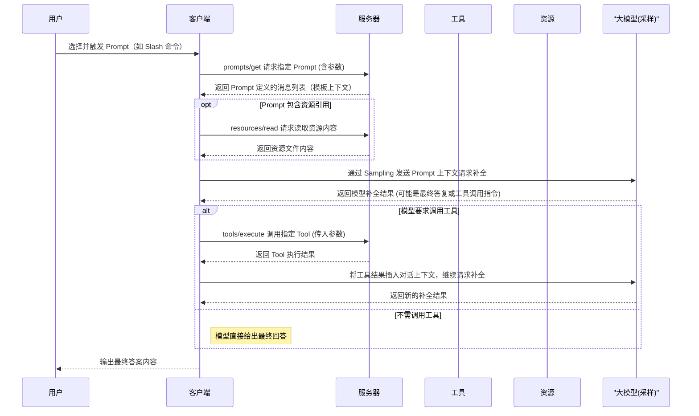

**You:**

1. 前提资源和主要参考例子。
java skd https://github.com/modelcontextprotocol/java-sdk/tree/main/mcp, 相关的测试例子。
python sdk https://github.com/modelcontextprotocol/python-sdk?tab=readme-ov-file。

mcp 官网介绍 https://modelcontextprotocol.io/introduction, 官方网址 https://github.com/modelcontextprotocol。
最新的mcp josn schema https://github.com/modelcontextprotocol/modelcontextprotocol/blob/main/schema/2025-03-26/schema.json。

2. 背景
   现在需要用 c++ 语言开发一个 mcp 的客户端和服务端的 sdk。或者是优先实现prompt 模块的客户端和服务端。
  现在需要梳理mcp 官方提供的 sdk 和 官方解释，还有协议。梳理架构图，方便了解有哪些模块，还有模块直接的关系。方便或者是便于开发c++ sdk 参考。也方便理解后续 mcp  prompt 模块的开发。
  后续或者下次可以可以优先梳理 prompt 详细完整的架构图或者是时许图。方便开发和参考。 
  python 和 java 的 sdk 调研那个一方便呢？更有参考性。 图用 mermaid 的语言画。

* * *

**ChatGPT:**

为了更好地梳理 MCP 协议及其 Java 和 Python SDK 的结构、模块划分与适配性，请问你希望我重点关注以下哪些内容：

1. SDK 的模块结构（如 prompt、chain、context 等）及其功能划分？
    
2. 客户端与服务端接口的实现方式？
    
3. 与 schema.json 的对应关系和数据交互格式？
    
4. 哪些部分适合优先用于 C++ SDK 的移植参考？
    

另外，你希望这份分析的输出包含 Java 和 Python 的对比总结吗？

* * *

**You:**

SDK 的模块结构（如 prompt、chain、context 等）及其功能划分，客户端与服务端接口的实现方式，json schema已经有对应的c++结构体实现和序列化，反序列化了。所以不需要调研对应关系了。

* * *

**ChatGPT:**

好的，我将会梳理 MCP 协议的整体模块结构，重点包括 Java 与 Python SDK 中的模块（如 prompt、chain、context 等）的功能划分，以及客户端与服务端接口的实现方式。输出将包括一张整体架构图（使用 mermaid 语法），以便参考后续 C++ SDK 的开发与移植。

稍后我会将整理好的内容分享给你。

* * *

**ChatGPT:**

# MCP 协议 Java 与 Python SDK 模块结构分析

## MCP SDK 模块结构总览

MCP（Model Context Protocol） SDK 采用分层架构，包含客户端（Client）、服务器（Server）、会话（Session）和传输（Transport）等层次[modelcontextprotocol.io](https://modelcontextprotocol.io/sdk/java/mcp-overview#:~:text=The%20SDK%20follows%20a%20layered,with%20clear%20separation%20of%20concerns)。服务器端提供**工具（Tool）**、**资源（Resource）**、**提示模板（Prompt）**等核心功能，以及**链式交互（Chain）**和**上下文（Context）**支持，用于丰富 LLM 的交互能力[modelcontextprotocol.io](https://modelcontextprotocol.io/sdk/java/mcp-overview#:~:text=,Multiple%20transport%20implementations)。客户端负责与服务器建立连接并通信，包括协议版本和功能协商、JSON-RPC 消息传输以及调用服务器提供的功能[modelcontextprotocol.io](https://modelcontextprotocol.io/sdk/java/mcp-client#:~:text=The%20MCP%20Client%20is%20a,side%20of%20the%20protocol%2C%20handling)[modelcontextprotocol.io](https://modelcontextprotocol.io/sdk/java/mcp-client#:~:text=,roots%20management%20and%20sampling%20support)。通信采用 JSON-RPC 消息格式，在传输层通过多种协议实现，包括标准输入输出（STDIO）管道、本地或网络的 HTTP **SSE**（Server-Sent Events，服务器推送事件）流等[modelcontextprotocol.io](https://modelcontextprotocol.io/sdk/java/mcp-overview#:~:text=,based%20HTTP%20streaming)[modelcontextprotocol.io](https://modelcontextprotocol.io/sdk/java/mcp-overview#:~:text=,in%20the%20core%20module)。下面的模块结构图展示了 MCP Java/Python SDK 的主要模块及关系：

```mermaid
flowchart LR
    subgraph 客户端 (Client)
        C[MCPClient<br/>McpSyncClient/McpAsyncClient]
    end
    subgraph 服务器 (Server)
        S[MCPServer<br/>McpSyncServer/McpAsyncServer]
        subgraph ServerFeatures
            Tools[工具<br/>Tool规范/实现]
            Resources[资源<br/>Resource规范/实现]
            Prompts[提示模板<br/>Prompt规范/实现]
        end
        S --> Tools
        S --> Resources
        S --> Prompts
    end
    subgraph 通信会话 (Session & Context)
        X[Session<br/>McpSession/Exchange<br/>Context 对象]
    end
    subgraph 传输层 (Transport)
        T1[STDIO 通道]
        T2[SSE/Stream HTTP 通道]
    end
    C -- JSON-RPC 请求 --> X
    S -- JSON-RPC 响应/回调 --> X
    X -- 序列化传输 --> T1
    X -- 序列化传输 --> T2
    T1 == 双向管道 ==> C
    T1 == 双向管道 ==> S
    T2 == HTTP长连接/SSE ==> C
    T2 == HTTP长连接/SSE ==> S
```

_图：MCP SDK 客户端与服务器架构模块图。客户端通过 Session 会话管理与服务器通信，双方使用传输层实现双向 JSON-RPC 消息交互。服务器包含工具、资源、提示模板等模块。Context/Exchange 提供上下文支持和链式调用能力。_

如上图所示，MCP SDK 的核心由客户端和服务器组件构成，二者通过 **McpSession** 管理会话状态。Session 层负责封装同步/异步通信模式和状态管理（Java 实现由 `DefaultMcpSession` 提供）[modelcontextprotocol.io](https://modelcontextprotocol.io/sdk/java/mcp-overview#:~:text=,Java%20HttpClient)。传输层实现底层消息收发，默认支持 STDIO（标准输入输出流）和基于 HTTP **SSE** 的长连接流，负责 JSON-RPC 消息的序列化和反序列化[modelcontextprotocol.io](https://modelcontextprotocol.io/sdk/java/mcp-overview#:~:text=,in%20the%20core%20module)。这种设计保证了客户端和服务器的解耦，可根据需要选择或插入不同传输方式[modelcontextprotocol.io](https://modelcontextprotocol.io/sdk/java/mcp-overview#:~:text=,based%20HTTP%20streaming)。在 Java SDK 中，核心功能都集中于 `mcp` 模块（无需外部 Web 框架即可使用内置 STDIO/SSE）[modelcontextprotocol.io](https://modelcontextprotocol.io/sdk/java/mcp-overview#:~:text=The%20core%20,without%20requiring%20external%20web%20frameworks)；另外提供可选的 Spring Boot 集成模块用于简化在 WebFlux/WebMVC 中使用 SSE[modelcontextprotocol.io](https://modelcontextprotocol.io/sdk/java/mcp-overview#:~:text=streaming%20%2A%20Servlet,based%20HTTP%20streaming)。Python SDK 则提供开箱即用的 CLI 和 FastAPI 集成，支持 STDIO、本地开发调试以及可挂载于 ASGI 的流式 HTTP 服务等方式，功能等价于 Java 实现（Python SDK 新版以“可流式HTTP”取代 SSE 作为生产环境推荐传输方式[github.com](https://github.com/modelcontextprotocol/python-sdk#:~:text=Streamable%20HTTP%20Transport)[github.com](https://github.com/modelcontextprotocol/python-sdk#:~:text=,stateless_http%3DTrue)）。

## 核心模块功能

MCP 协议定义了一系列核心模块与概念，用于标准化 LLM 与外部工具/数据的交互。服务器端可以注册工具、资源和提示模板，客户端通过协议接口发现并调用这些功能。同时，Context 和 Chain 等机制提供了交互过程中的上下文管理和多步骤链式执行能力。下面对各核心模块进行说明：

### Prompt 提示模板模块

**Prompt（提示模板）**模块用于定义可重用的提示词模板或多轮对话流程，服务器通过 Prompt 向客户端暴露标准化的交互方式[github.com](https://github.com/asinghcsu/model-context-protocol-survey#:~:text=Prompts)。每个 Prompt 具有唯一名称、描述以及参数列表，可支持动态参数替换和上下文插入[modelcontextprotocol.io](https://modelcontextprotocol.io/docs/concepts/prompts#:~:text=Prompts%20in%20MCP%20are%20predefined,templates%20that%20can)。通过 Prompt，复杂的交互可以预先定义为模板，让客户端或代理直接调用以指导 LLM 完成特定任务。例如服务器可以提供一个代码审查的 Prompt 模板，包含多条预设的用户/助手消息，让 LLM 按模板流程进行分析。

Prompt 模块的主要作用包括：

* **预定义模板复用**：将常见的提示场景封装为模板，标准化 LLM 交互[github.com](https://github.com/asinghcsu/model-context-protocol-survey#:~:text=Prompts)。例如“分析代码”的 Prompt 可以定义参数如编程语言，LLM 接收模板后直接按照其中提示要求输出结果。
    
* **动态参数**：Prompt 支持定义占位符参数，由客户端在调用时提供实际值。模板渲染时注入参数，使提示更具灵活性[modelcontextprotocol.io](https://modelcontextprotocol.io/docs/concepts/prompts#:~:text=Prompts%20in%20MCP%20are%20predefined,templates%20that%20can)。
    
* **多轮对话流程**：一个 Prompt 可以包含多条消息，模拟一系列链式的交互步骤（如用户提问-助手回答-用户追问等）[modelcontextprotocol.io](https://modelcontextprotocol.io/docs/concepts/prompts#:~:text=,like%20slash%20commands)。这使得 **Prompt** 本身可以实现简单的“链式”交互，把多步对话打包为一次调用。
    
* **上下文嵌入**：Prompt 模板内可以引用资源数据等上下文，使提示词包含外部信息[modelcontextprotocol.io](https://modelcontextprotocol.io/docs/concepts/prompts#:~:text=,like%20slash%20commands)。例如模板里插入来自某文件资源的内容，供 LLM 阅读。
    
* **客户端发现与调用**：客户端可通过协议方法 `prompts/list` 获取服务器可用的所有 Prompt 列表，通过 `prompts/get` 请求具体的 Prompt 模板内容[github.com](https://github.com/asinghcsu/model-context-protocol-survey#:~:text=,prompts%2Fget)。用户在前端选择 Prompt 后，客户端获取模板并填充参数，再将完整提示发送给 LLM。
    

在 Java SDK 中，Prompt 由 `Prompt` 类描述（包含名称、描述、参数列表），服务器通过 `McpServer.addPrompt(...)` 注册 Prompt 及其处理逻辑。例如可创建 `SyncPromptSpecification`，提供 Prompt 定义和对应的处理函数，当客户端请求该 Prompt 时返回预生成的消息列表[modelcontextprotocol.io](https://modelcontextprotocol.io/sdk/java/mcp-server#:~:text=%2F%2F%20Sync%20prompt%20specification%20var,)[modelcontextprotocol.io](https://modelcontextprotocol.io/sdk/java/mcp-server#:~:text=The%20prompt%20definition%20includes%20name,instance)。Python SDK 中，通过装饰器 `@mcp.prompt()` 简洁地将一个函数注册为 Prompt[github.com](https://github.com/modelcontextprotocol/python-sdk#:~:text=%40mcp.prompt%28%29%20def%20review_code%28code%3A%20str%29%20,Please%20review%20this%20code%3A%5Cn%5Cn%7Bcode)。该函数可以直接返回字符串（单轮提示）或`Message`对象列表（多轮对话），SDK 会将其封装为 Prompt 响应发送给客户端。

### Chain 链式交互模块

**Chain（链式交互）**并非单指某个独立类，而是 MCP 协议支持的一种交互模式：将多个工具调用或提示/模型响应步骤串联起来，形成复杂的多阶段工作流。MCP 通过灵活的客户端-服务器角色和调用机制，实现了**代理式多步任务链**的能力[github.com](https://github.com/asinghcsu/model-context-protocol-survey#:~:text=MCP%20is%20a%20catalyst%20for,collaborate%2C%20and%20chain%20tasks%20dynamically)。简单来说，MCP 允许服务器在一次用户会话中引导 LLM 连续完成一系列子任务，每个子任务可能涉及调用工具、读取资源或进一步向 LLM 查询，从而动态地**链式执行任务**[github.com](https://github.com/asinghcsu/model-context-protocol-survey#:~:text=MCP%20is%20a%20catalyst%20for,collaborate%2C%20and%20chain%20tasks%20dynamically)。

链式交互的典型特性和作用包括：

* **任务编排**：MCP 节点既可作为客户端又可作为服务器，因此一个 MCP 服务器既能响应来自上游客户端的请求，又能作为客户端去调用下游的子工具或子代理，实现任务编排[github.com](https://github.com/asinghcsu/model-context-protocol-survey#:~:text=MCP%20is%20a%20catalyst%20for,collaborate%2C%20and%20chain%20tasks%20dynamically)。例如，一个复杂查询可能需要先调用数据库工具获取数据，再调用一个分析工具处理数据，最后将结果发送给 LLM 做总结。这一连串步骤在 MCP 下可以由服务器协同完成，再把最终结果返回给最初请求的客户端。
    
* **多代理协作**：MCP 支持“动态代理链”，即一个 orchestrator（协调者）代理根据需要触发其他专用子代理来完成子任务[github.com](https://github.com/asinghcsu/model-context-protocol-survey#:~:text=,processes%20ensure%20security%20and%20reliability)。通过这种**Agent Chaining**机制，复杂工作流可以被拆解给不同能力的模块顺序执行，最终组合结果。
    
* **Prompt链和工具链**：Prompt 本身支持多轮消息模板，实现简单的链式对话。而对于更复杂的跨工具链，服务器可以在工具实现或 Prompt 实现中调用其他工具或请求 LLM 完成中间步骤。例如服务器提供一个“AI计算器”工具，其实现中先检查所需算术操作，如果是复杂问题则通过调用 LLM（采样功能）来求解，再将结果返回[modelcontextprotocol.io](https://modelcontextprotocol.io/sdk/java/mcp-server#:~:text=var%20calculatorTool%20%3D%20new%20McpServerFeatures,Check%20if%20client%20supports%20sampling)。这种在工具实现中反过来调用模型的流程，实质上是一次**链式调用**（服务器调用客户端的模型能力完成工具的一部分）[modelcontextprotocol.io](https://modelcontextprotocol.io/sdk/java/mcp-server#:~:text=%28exchange%2C%20arguments%29%20,Check%20if%20client%20supports%20sampling)。
    
* **采样（Sampling）功能**：链式交互离不开让 LLM 参与中间步骤。MCP 提供**Sampling**能力用于服务器请求客户端执行一次模型补全（即生成内容）[modelcontextprotocol.io](https://modelcontextprotocol.io/sdk/java/mcp-overview#:~:text=,Multiple%20transport%20implementations)。当客户端和服务器在功能协商时都支持采样(completions)，服务器端即可在工具实现中通过会话上下文请求客户端的 LLM进行推理。Java SDK 中，服务器在启用`.completions()`能力后，可以注册 `CompletionSpecification` 来定义特定 Prompt 下参数的自动补全逻辑[modelcontextprotocol.io](https://modelcontextprotocol.io/sdk/java/mcp-server#:~:text=Completion%20Specification)[modelcontextprotocol.io](https://modelcontextprotocol.io/sdk/java/mcp-server#:~:text=%2F%2F%20Create%20a%20sync%20server,code_review)，或者直接在工具实现里利用 `McpServerExchange` 发起 `create_message` 请求让客户端生成内容。Python SDK 则在 `Context` 对象中提供相应方法让服务器方便地调用模型、报告进度等。**采样**是实现复杂链的关键：通过服务器调用模型，可以在人机协作流程中嵌入额外的AI推理步骤，实现如Chain-of-Thought（逐步推理）等模式。
    

总之，Chain 模块代表了 MCP 所支持的**多阶段工作流**能力。它并不像 Tool/Prompt 那样有单一接口，而是体现在协议的双向调用特性和服务器实现逻辑中。借助链式交互，MCP 可以将多个调用串联，让 AI 应用完成动态复杂的任务[github.com](https://github.com/asinghcsu/model-context-protocol-survey#:~:text=MCP%20is%20a%20catalyst%20for,collaborate%2C%20and%20chain%20tasks%20dynamically)。

### Context 上下文模块

**Context（上下文）**模块负责在请求处理过程中提供环境数据和实用功能，使工具或资源的实现能够访问协议提供的各种服务。在 Python SDK 中，`Context` 对象会传递给每个工具函数或资源函数，用于获取请求相关的上下文和调用便捷方法[github.com](https://github.com/modelcontextprotocol/python-sdk#:~:text=mcp%20%3D%20FastMCP%28)。通过 Context，对应的服务器实现可以：

* **访问请求上下文**：`ctx.request_context` 通常包含当前请求的一些信息，以及服务器在启动时设置的全局状态（如通过 lifespan 机制注入的数据库连接等）。例如上文示例中，通过 `ctx.request_context.lifespan_context.db` 获取启动时创建的数据库实例[github.com](https://github.com/modelcontextprotocol/python-sdk#:~:text=mcp%20%3D%20FastMCP%28)。这确保了在处理工具/资源时能够使用共享的应用状态或资源。
    
* **调用协议功能**：Context 提供了一组方法封装常用的协议操作。例如，`ctx.read_resource(uri)` 可以在工具实现中直接读取服务器上已注册的某个资源内容[github.com](https://github.com/modelcontextprotocol/python-sdk#:~:text=%40mcp.tool%28%29%20async%20def%20long_task%28files%3A%20list,Processing%20complete)；`ctx.report_progress(i, total)` 用于在长任务处理中向客户端发送进度通知[github.com](https://github.com/modelcontextprotocol/python-sdk#:~:text=%40mcp.tool%28%29%20async%20def%20long_task%28files%3A%20list,Processing%20complete)；`ctx.info(msg)` 则发送一般日志/信息消息给客户端，用于日志记录或前端提示[github.com](https://github.com/modelcontextprotocol/python-sdk#:~:text=%40mcp.tool%28%29%20async%20def%20long_task%28files%3A%20list,Processing%20complete)。这些方法让开发者不用手动构造 JSON-RPC 消息，就能触发协议相应功能。
    
* **管理认证与权限**：Context 还可与认证模块结合，获取当前调用者的身份信息或令牌（如果服务器开启了 OAuth 等认证机制[github.com](https://github.com/modelcontextprotocol/python-sdk#:~:text=Authentication)[github.com](https://github.com/modelcontextprotocol/python-sdk#:~:text=auth%3DAuthSettings%28%20issuer_url%3D,)）。这使工具实现能根据调用方权限决定是否允许访问受保护的资源等。
    
* **Java 实现中的 Exchange**：在 Java SDK 中，Context 概念主要由 **McpServerExchange**（和对应的 **McpClientExchange**）体现。`Exchange` 对象在调用处理时提供类似上下文的作用，包含请求内容、会话引用，并提供方法与客户端互动。例如，在 Java 工具实现中，handler 函数第一个参数是 `McpAsyncServerExchange`，可用于检查客户端能力（如是否支持采样）并在必要时与客户端交互[modelcontextprotocol.io](https://modelcontextprotocol.io/sdk/java/mcp-server#:~:text=%28exchange%2C%20arguments%29%20,Check%20if%20client%20supports%20sampling)。通过 Exchange，服务器代码可以发送通知（日志、进度）或请求客户端执行补全等，实现与 Python Context 同等的功能。
    

综上，Context 模块保证了**请求处理环境的一致性**和**功能易用性**。开发者借助 Context 提供的API，可以方便地执行常见操作并访问共享状态，而无需自行管理底层通信细节[github.com](https://github.com/modelcontextprotocol/python-sdk#:~:text=Context)。上下文模块也是实现链式调用的基础：它提供的接口让服务器在执行一个工具/Prompt过程中，再去调用资源或请求模型，从而把不同环节有机串联起来。

### 工具（Tool）模块

**Tool（工具）**模块允许服务器定义可执行的功能，供 LLM 通过客户端调用[github.com](https://github.com/asinghcsu/model-context-protocol-survey#:~:text=Tools)。工具类似于可远程调用的函数或操作，每个 Tool 定义包括名称、说明、输入参数模式和输出结果结构。客户端可以通过 `tools/list` 获取服务器提供的工具清单，并通过 `tools/call` 请求执行某个工具[github.com](https://github.com/asinghcsu/model-context-protocol-survey#:~:text=Fig,invocation%20using%20defined%20JSON%20schemas)。工具执行通常会产生某种副作用或计算结果，返回给客户端用于后续对话。

工具模块的特点：

* **功能封装**：将某项逻辑或操作封装为独立工具。例如“calculator”工具执行加法运算，或“search”工具查询数据库[modelcontextprotocol.io](https://modelcontextprotocol.io/sdk/java/mcp-client#:~:text=%2F%2F%20List%20available%20tools%20ListToolsResult,listTools)[modelcontextprotocol.io](https://modelcontextprotocol.io/sdk/java/mcp-client#:~:text=CallToolResult%20result%20%3D%20client,3%29%29)。LLM 通过这些工具可以扩展能力，获取外部数据或执行计算。
    
* **JSON Schema 参数**：工具的输入输出通过 JSON Schema 来描述，以实现跨平台的严格类型校验[github.com](https://github.com/asinghcsu/model-context-protocol-survey#:~:text=,tools%2Fcall)。在 Java SDK 中，开发者需要为每个工具提供输入参数的 JSON Schema 字符串和输出结构说明（通常输出直接封装在结果对象中）[modelcontextprotocol.io](https://modelcontextprotocol.io/sdk/java/mcp-server#:~:text=,SyncToolSpecification)[modelcontextprotocol.io](https://modelcontextprotocol.io/sdk/java/mcp-server#:~:text=%28exchange%2C%20arguments%29%20,)。Python SDK 则利用类型注解自动推断参数类型，无需手动编写 JSON Schema：例如函数签名`def add(a: int, b: int) -> int`会自动被解析为两个整数参数并产出整数结果，无需显式提供模式。
    
* **工具实现**：服务器注册工具时，需要提供工具的实现函数。Java SDK 提供 `SyncToolSpecification` 和 `AsyncToolSpecification` 类来包装工具定义和实现逻辑[modelcontextprotocol.io](https://modelcontextprotocol.io/sdk/java/mcp-server#:~:text=var%20syncToolSpecification%20%3D%20new%20McpServerFeatures,)[modelcontextprotocol.io](https://modelcontextprotocol.io/sdk/java/mcp-server#:~:text=var%20asyncToolSpecification%20%3D%20new%20McpServerFeatures,)。实现函数通常接收 `exchange`（用于上下文交互）和解析后的参数，返回结果对象（同步)或 Reactive Mono（异步）[modelcontextprotocol.io](https://modelcontextprotocol.io/sdk/java/mcp-server#:~:text=var%20syncToolSpecification%20%3D%20new%20McpServerFeatures,)[modelcontextprotocol.io](https://modelcontextprotocol.io/sdk/java/mcp-server#:~:text=var%20asyncToolSpecification%20%3D%20new%20McpServerFeatures,)。Python SDK 则通过装饰器将一个同步或异步函数直接作为工具逻辑，SDK 自动处理参数解析和结果封装[github.com](https://github.com/modelcontextprotocol/python-sdk#:~:text=,return%20a%20%2B%20b)[github.com](https://github.com/modelcontextprotocol/python-sdk#:~:text=%40mcp,return%20a%20%2B%20b)。
    
* **执行与通知**：当客户端调用工具时，服务器执行对应实现并将结果通过 JSON-RPC 返回。如果工具执行涉及长时间过程，服务器可利用 Context/Exchange 提供的方法发送进度更新或日志消息，客户端可以选择将这些信息展示给用户（例如 Claude 客户端在工具执行时显示工具的print输出或进度)。
    
* **变更通知**：MCP 协议还支持当服务器端工具列表变化时通知客户端[modelcontextprotocol.io](https://modelcontextprotocol.io/sdk/java/mcp-client#:~:text=%2A%20Message%20transport%20and%20JSON,Prompt%20system%20interactions)。Java SDK 中客户端可以设置 `toolsChangeConsumer` 来异步接收工具增减的通知事件[modelcontextprotocol.io](https://modelcontextprotocol.io/sdk/java/mcp-client#:~:text=.sampling%28request%20,prompts)。这样LLM代理可以动态感知新工具的可用性变化。
    

### 资源（Resource）模块

**Resource（资源）**模块用于让服务器以 URI 的形式暴露只读数据给客户端[github.com](https://github.com/asinghcsu/model-context-protocol-survey#:~:text=Resources)。资源类似于REST风格的 GET 接口，但统一通过 MCP 协议管理。每个资源由一个 URI 模板标识（如`file://{path}`或`db://{table}`）、名称、描述和MIME类型等元数据描述。客户端可通过 `resources/list` 枚举服务器提供的所有资源入口，通过指定 URI 调用 `resources/read` 来获取资源内容[github.com](https://github.com/asinghcsu/model-context-protocol-survey#:~:text=,and%20URI%20templates)。

资源模块的要点：

* **数据上下文**：资源通常提供给 LLM 作为上下文信息，而不直接执行动作。例如文件内容、数据库记录、配置值等都可以作为资源暴露[github.com](https://github.com/asinghcsu/model-context-protocol-survey#:~:text=Resources)。LLM 在需要外部知识时，客户端可以读取相关资源并将内容插入对话上下文。
    
* **URI 模板**：服务器可以定义带参数的URI模式，如`greeting://{name}`，客户端在调用时填入参数（如`greeting://Alice`）获取个性化内容[github.com](https://github.com/modelcontextprotocol/python-sdk#:~:text=,Hello%2C%20%7Bname)。URI 模板使资源访问灵活且规范，客户端也能通过Pattern知道需要提供哪些参数。
    
* **资源实现**：Java SDK 使用 `Resource` 类描述资源（URI、名称、描述、MIME等），并通过 `SyncResourceSpecification`/`AsyncResourceSpecification` 注册资源读取逻辑[modelcontextprotocol.io](https://modelcontextprotocol.io/sdk/java/mcp-server#:~:text=%2F%2F%20Sync%20resource%20specification%20var,contents%29%3B)[modelcontextprotocol.io](https://modelcontextprotocol.io/sdk/java/mcp-server#:~:text=%2F%2F%20Sync%20resource%20specification%20var,contents%29%3B)。实现函数通常接受 `exchange` 和读取请求，返回封装了内容的 `ReadResourceResult`[modelcontextprotocol.io](https://modelcontextprotocol.io/sdk/java/mcp-server#:~:text=%2F%2F%20Sync%20resource%20specification%20var,contents%29%3B)。Python SDK 则类似地用 `@mcp.resource("uri模板")` 装饰器注册函数，函数返回字符串或字节数据即为资源内容[github.com](https://github.com/modelcontextprotocol/python-sdk#:~:text=,Hello%2C%20%7Bname)。SDK 会处理编码和 MIME 类型封装（如 Python 中可以返回 `mcp.Image`对象传输二进制图像[github.com](https://github.com/modelcontextprotocol/python-sdk#:~:text=FastMCP%20provides%20an%20,that%20automatically%20handles%20image%20data)[github.com](https://github.com/modelcontextprotocol/python-sdk#:~:text=%40mcp.tool%28%29%20def%20create_thumbnail%28image_path%3A%20str%29%20,png)）。
    
* **缓存与变更**：MCP 允许客户端订阅资源列表的变化[github.com](https://github.com/asinghcsu/model-context-protocol-survey#:~:text=Resources)。当服务器增加/删除资源根（Roots）或资源可用性变化时，客户端可以收到通知，保持与服务器的一致。Java SDK 提供了 `resourcesChangeConsumer` 供客户端监听资源列表更新[modelcontextprotocol.io](https://modelcontextprotocol.io/sdk/java/mcp-client#:~:text=logger.info%28,prompts)。另外，一些实现可能对资源内容进行缓存，避免频繁读取大量数据。
    

通过工具和资源两个模块，MCP 服务器实现了**操作**（Tool）和**数据**（Resource）的分离提供：前者执行动作，后者提供只读信息。LLM 代理可以先读取资源获取所需背景，再调用工具执行操作，将两者结果结合起来完成任务。这种模式被证明对于让 LLM 利用外部知识和能力是有效的标准方案[github.com](https://github.com/asinghcsu/model-context-protocol-survey#:~:text=End)[github.com](https://github.com/asinghcsu/model-context-protocol-survey#:~:text=1,in%20a%20clear%2C%20structured%20format)。

## 客户端与服务端接口的实现与交互方式

MCP 客户端和服务器通过**JSON-RPC**进行通信，支持双向的请求/响应模式[modelcontextprotocol.io](https://modelcontextprotocol.io/sdk/java/mcp-overview#:~:text=,in%20the%20core%20module)。不像传统 RESTful API 那样由客户端单向请求、服务器响应，MCP 允许服务器在需要时**反向调用**客户端提供的功能（例如请求模型补全或发送通知）。通信通常建立在长连接之上，具体可选择以下传输机制：

* **STDIO 通道**：主要用于本地进程间通信，客户端和服务器通过标准输入输出流交换 JSON-RPC 消息[modelcontextprotocol.io](https://modelcontextprotocol.io/sdk/java/mcp-overview#:~:text=%2A%20Stdio,convenience%20if%20using%20Spring%20Framework)。这种方式常用于将工具打包为独立进程（如插件）供本地主程序调用，或调试环境下快速连接。
    
* **HTTP SSE 通道**：基于 HTTP 的 Server-Sent Events（服务器推送）实现双向通信流[modelcontextprotocol.io](https://modelcontextprotocol.io/sdk/java/mcp-overview#:~:text=%2A%20Stdio,Synchronous%20and%20Asynchronous%20programming%20paradigms)。通常由客户端发起HTTP连接，服务器保持连接不断开，通过 SSE 推送事件（JSON-RPC消息）到客户端，实现服务器->客户端的消息通道；同时客户端仍可通过HTTP POST等方式发送请求到服务器。相比 WebSocket，SSE利用了HTTP标准且易于与现有HTTP服务器集成[modelcontextprotocol.io](https://modelcontextprotocol.io/sdk/java/mcp-overview#:~:text=,based%20HTTP%20streaming)。MCP 默认实现了基于 Java HttpClient 的 SSE客户端传输和 Servlet 的 SSE服务端传输[modelcontextprotocol.io](https://modelcontextprotocol.io/sdk/java/mcp-overview#:~:text=%2A%20Stdio,Synchronous%20and%20Asynchronous%20programming%20paradigms)。这种模式下，**客户端向服务器发送请求**可视为普通HTTP调用，而**服务器向客户端的回调/通知**则走在SSE事件流中。
    
* **Streamable HTTP**：这是对 SSE 的改进命名，实质用途类似，即通过HTTP长连接实现持续双向通信（服务器单向流+客户端请求）。Python SDK 文档指出“可流式HTTP”将取代 SSE 用于生产环境[github.com](https://github.com/modelcontextprotocol/python-sdk#:~:text=Streamable%20HTTP%20Transport)。实现细节上，它可能通过HTTP/2的流或定制协议实现更可靠的全双工通信。对开发者而言，使用方式与 SSE 一致（只是在启动服务器时选择传输方式为`streamable-http`[github.com](https://github.com/modelcontextprotocol/python-sdk#:~:text=,stateless_http%3DTrue)）。
    
* **可选 WebSocket**：目前官方文档未明确提供 WebSocket 实现，但原理上 JSON-RPC 可以封装在 WebSocket 中传输。如果需要，社区实现或未来版本可能会增加WebSocket传输支持。不过 SSE/流式HTTP已经能够满足实时性需求，而且借助HTTP基础更容易部署。
    

**客户端初始化**：典型交互从客户端初始化连接开始。客户端创建 `McpClient` 实例时指定所用传输方式（如 STDIO 或 SSE）并与服务器建立连接[modelcontextprotocol.io](https://modelcontextprotocol.io/sdk/java/mcp-client#:~:text=,API)[modelcontextprotocol.io](https://modelcontextprotocol.io/sdk/java/mcp-client#:~:text=%2F%2F%20Initialize%20connection%20client)。连接建立后首先进行**协议版本兼容和功能协商**：双方交换各自支持的 MCP 协议版本和可用**能力（Capabilities）**[modelcontextprotocol.io](https://modelcontextprotocol.io/sdk/java/mcp-client#:~:text=The%20MCP%20Client%20is%20a,side%20of%20the%20protocol%2C%20handling)。能力包括是否支持工具、资源、Prompt、Roots、日志、采样等[modelcontextprotocol.io](https://modelcontextprotocol.io/sdk/java/mcp-server#:~:text=,build)。协商确定共同支持的功能集合后，会话正式开始[modelcontextprotocol.io](https://modelcontextprotocol.io/sdk/java/mcp-overview#:~:text=,subscription%20system%2C%20and%20content%20retrieval)。

**消息交互流程**：客户端和服务器遵循 JSON-RPC 规范交换消息，每条消息包含`id`、`method`、`params`等字段。下面是一个典型调用流程示意[github.com](https://github.com/asinghcsu/model-context-protocol-survey#:~:text=Workflow%20Highlights%3A)：

1. **客户端请求**：用户在前端触发某操作（例如让助手总结文件内容）。客户端（LLM应用）先调用服务器的 `resources/read` 接口获取文件内容，再调用服务器的某个 Prompt（或 Tool）让其生成合适的提示模板，并将文件内容作为上下文或参数嵌入[github.com](https://github.com/asinghcsu/model-context-protocol-survey#:~:text=1,LLM%20completions%20with%20human%20oversight)。这些请求通过 JSON-RPC 序列化后发送给服务器。
    
2. **服务器处理**：服务器接收到请求后，路由到对应的处理模块：如资源请求由资源模块读取文件并返回内容；Prompt 请求由预定义模板填充内容，返回一系列消息（可能包含系统提示+用户内容等）[github.com](https://github.com/asinghcsu/model-context-protocol-survey#:~:text=1,LLM%20completions%20with%20human%20oversight)。服务器将结果打包为 JSON-RPC 响应，通过传输层发回客户端。
    
3. **客户端调用模型**：客户端拿到 Prompt 模板和资源内容后，将完整的提示提交给本地或云端的 LLM，得到模型输出。这一步发生在客户端（通常在 Claude/ChatGPT 等前端应用中）[github.com](https://github.com/asinghcsu/model-context-protocol-survey#:~:text=1,LLM%20completions%20with%20human%20oversight)。模型可能回答了文件总结。
    
4. **服务器后续调用（可选）**：在某些复杂情景中，服务器在处理请求时还需要**反向请求客户端**。例如当客户端调用某工具，而工具实现需要模型协助，服务器会通过 JSON-RPC 调用一个如`create_message`的方法，请求客户端生成内容（这利用了之前协商的采样能力）[modelcontextprotocol.io](https://modelcontextprotocol.io/sdk/java/mcp-server#:~:text=%28exchange%2C%20arguments%29%20,Check%20if%20client%20supports%20sampling)。客户端执行模型推理后将结果通过JSON-RPC返回服务器继续流程。这种服务器发起->客户端响应的交互通过已建立的长连接通道（SSE等）进行，保证了流程顺畅衔接。
    
5. **结果返回**：最终，客户端将模型的回答发送回用户界面；或者在链式任务中，服务器整理多步子任务的结果后，通过其对客户端的响应一并返回用户请求的最终答案[github.com](https://github.com/asinghcsu/model-context-protocol-survey#:~:text=1,in%20a%20clear%2C%20structured%20format)。整个过程中的所有消息交换均经过 JSON-RPC 格式封装，确保双方解耦并严格按照协议处理。
    

在 Java SDK 中，提供了同步和异步两套客户端接口，开发者可以选择阻塞调用或基于 Reactive 流式调用[modelcontextprotocol.io](https://modelcontextprotocol.io/sdk/java/mcp-client#:~:text=%2F%2F%20Create%20an%20async%20client,Mono.just%28new%20CreateMessageResult%28response)[modelcontextprotocol.io](https://modelcontextprotocol.io/sdk/java/mcp-client#:~:text=%2F%2F%20Initialize%20connection%20and%20use,)。例如，同步客户端调用`client.listTools()`直接返回结果[modelcontextprotocol.io](https://modelcontextprotocol.io/sdk/java/mcp-client#:~:text=%2F%2F%20List%20available%20tools%20ListToolsResult,listTools)；而异步客户端则返回一个 `Mono`，可通过Reactive链式操作来处理[modelcontextprotocol.io](https://modelcontextprotocol.io/sdk/java/mcp-client#:~:text=%2F%2F%20Initialize%20connection%20and%20use,3%29%20%29%29%3B)。无论同步异步，底层都是通过 Session 管理与服务器的 JSON-RPC 通信。客户端还可以订阅服务器端的**变更通知**，如工具列表更新、资源列表更新、Prompt列表更新等，在 Java 中通过 `.toolsChangeConsumer(...)` 等设置回调[modelcontextprotocol.io](https://modelcontextprotocol.io/sdk/java/mcp-client#:~:text=.sampling%28request%20,prompts)。Python SDK 的客户端功能相对简单一些，一般通过命令行工具或脚本触发服务器交互；其核心交互同样遵循上述模式，只是 Python 开发者更多地使用服务器端功能，客户端功能主要用于测试或集成其他代理（如 LangChain 中也有适配 MCP 的客户端）。

值得注意的是，MCP 的接口方法并未采用RESTful风格的URL路径，而是通过JSON消息中的`method`区分（如`"method": "tools/call"`）。因此在传输层看，所有请求可能都是发往一个固定的HTTP端点或管道，但内容里指明了要执行的操作。这种设计方便在单一连接中复用多种功能调用，并简化了长连接场景下的路由管理[modelcontextprotocol.io](https://modelcontextprotocol.io/sdk/java/mcp-overview#:~:text=,subscription%20system%2C%20and%20content%20retrieval)。同时，由于采用标准的JSON-RPC格式，实现中可以直接利用成熟的JSON解析和RPC处理库，保证类型安全的响应处理和错误处理机制[modelcontextprotocol.io](https://modelcontextprotocol.io/sdk/java/mcp-overview#:~:text=,subscription%20system%2C%20and%20content%20retrieval)。总体来说，MCP 的通信是**双工的、长连接的RPC交互**，结合了 Web API 和实时流的优点，既有REST的结构化数据格式，又有持续会话的状态和推送能力。

## Java 与 Python SDK 结构异同比较及 C++ 实现参考

**Java SDK 与 Python SDK 的相似点**：两种官方 SDK 都完全实现了 MCP 协议规范，提供了客户端和服务器两端的功能。它们都支持 MCP 定义的核心概念（资源、工具、Prompt、Roots 等）和能力协商机制[modelcontextprotocol.io](https://modelcontextprotocol.io/sdk/java/mcp-client#:~:text=servers.%20It%20implements%20the%20client,of%20the%20protocol%2C%20handling)[modelcontextprotocol.io](https://modelcontextprotocol.io/sdk/java/mcp-server#:~:text=The%20MCP%20Server%20is%20a,of%20the%20protocol%2C%20responsible%20for)。在传输层面，两者都内置支持 STDIO 和基于HTTP的长连接流（SSE/可流HTTP）[modelcontextprotocol.io](https://modelcontextprotocol.io/sdk/java/mcp-overview#:~:text=,based%20HTTP%20streaming)。因此，无论使用哪种语言，MCP 的对外行为和接口调用流程基本一致，保证了跨语言的一致性：例如客户端调用`listTools`、服务器实现工具处理、Context 用法等概念是通用的。

**Java SDK 的特点**：Java 实现采用典型的分层架构和强类型接口设计，更加注重模块边界清晰和可扩展性：

* _分层与模块化_: Java SDK 将不同关注点分离为不同类和包，例如 `McpClient/McpServer` 处理高层协议逻辑，`McpSession` 管理状态和异步调度，`McpTransport` 接口及实现类（如 `StdioTransport`）处理底层IO[modelcontextprotocol.io](https://modelcontextprotocol.io/sdk/java/mcp-overview#:~:text=,Java%20HttpClient)。此外，Java SDK 拆分出 BOM、Spring 集成等子模块，以适应不同运行环境（纯 Java 或 Spring Boot）。这种架构清晰地体现了职责分离，每层都可以独立替换或配置，例如开发者可以自定义 Transport 实现以适配特殊传输要求。
    
* _强类型规范_: Java 使用类来表示 MCP 的各种实体和请求/响应，例如有 `Tool` 类、`Resource` 类、`Prompt` 类分别描述相应对象结构；还有如 `CallToolRequest/Result`、`GetPromptRequest/Result` 等类型封装每种调用的参数和返回。借助泛型和接口，Java SDK 实现了类型安全的RPC调用封装，使开发者在编译期即可发现参数错误。例如 `McpSyncClient.callTool()` 需要传入 `CallToolRequest`，返回即是相应的 `CallToolResult` 对象。[modelcontextprotocol.io](https://modelcontextprotocol.io/sdk/java/mcp-client#:~:text=%2F%2F%20List%20available%20tools%20ListToolsResult,listTools)[modelcontextprotocol.io](https://modelcontextprotocol.io/sdk/java/mcp-client#:~:text=CallToolResult%20result%20%3D%20client,3%29%29)这种设计减少了手工解析 JSON 的繁琐，也降低了出错概率。
    
* _规范注册和 Builder 模式_: Java SDK 注册服务器功能时，需要明确地构造“规格说明”（Specification）。开发者必须提供**完整的元数据**（如工具的 JSON Schema）和实现回调，将其包装在 `SyncToolSpecification`/`ResourceSpecification` 等对象中再注册[modelcontextprotocol.io](https://modelcontextprotocol.io/sdk/java/mcp-server#:~:text=,SyncToolSpecification)[modelcontextprotocol.io](https://modelcontextprotocol.io/sdk/java/mcp-server#:~:text=var%20syncToolSpecification%20%3D%20new%20McpServerFeatures,)。尽管略显冗长，但这种显式定义确保了服务器公开的每个接口都有明确的契约，可供客户端自动消费和校验[modelcontextprotocol.io](https://modelcontextprotocol.io/sdk/java/mcp-server#:~:text=var%20syncToolSpecification%20%3D%20new%20McpServerFeatures,)[modelcontextprotocol.io](https://modelcontextprotocol.io/sdk/java/mcp-server#:~:text=The%20Tool%20specification%20includes%20a,a%20map%20of%20tool%20arguments)。同时，Java SDK 广泛使用 **Builder** 模式来构建客户端和服务器实例：例如通过`McpServer.sync(...).capabilities(...).build()`链式设置参数[modelcontextprotocol.io](https://modelcontextprotocol.io/sdk/java/mcp-server#:~:text=%2F%2F%20Create%20a%20server%20with,build)[modelcontextprotocol.io](https://modelcontextprotocol.io/sdk/java/mcp-server#:~:text=McpSyncServer%20syncServer%20%3D%20McpServer.sync%28transportProvider%29%20.serverInfo%28%22my,build)。这种模式在 C++ 中也很常见（可以用方法连调或 Fluent 接口实现），有利于配置复杂对象。
    
* _同步 vs 异步 API_: Java SDK 区分同步和异步调用，提供了 `McpSyncClient`/`McpAsyncClient` 以及 `McpSyncServer`/`McpAsyncServer` 两套接口实现[modelcontextprotocol.io](https://modelcontextprotocol.io/sdk/java/mcp-client#:~:text=%2F%2F%20Create%20an%20async%20client,Mono.just%28new%20CreateMessageResult%28response)[modelcontextprotocol.io](https://modelcontextprotocol.io/sdk/java/mcp-server#:~:text=%2F%2F%20Create%20an%20async%20server,build)。异步实现利用 Reactor (Mono/Flux) 实现响应式流，非常适合与 Spring WebFlux 集成；同步实现则方便在普通阻塞环境使用。C++ 开发者若实现SDK，也需要考虑提供同步和异步两种接口（例如通过 `std::future` 或协程来实现异步等待），以适应不同风格的应用需求。
    

**Python SDK 的特点**：Python 实现充分利用了动态语言的优势，提供了高度简化的开发体验：

* _装饰器和自动推导_: Python SDK 使用**装饰器**来声明工具、资源、Prompt 等[github.com](https://github.com/modelcontextprotocol/python-sdk#:~:text=,return%20a%20%2B%20b)[github.com](https://github.com/modelcontextprotocol/python-sdk#:~:text=%40mcp.prompt%28%29%20def%20review_code%28code%3A%20str%29%20,Please%20review%20this%20code%3A%5Cn%5Cn%7Bcode)。开发者只需编写普通的函数，添加如`@mcp.tool()`或`@mcp.resource(uri)`的装饰器，SDK 就会自动将其注册到服务器，并通过函数签名推断参数和返回类型。这意味着**无需手工定义 JSON Schema**或结果结构，SDK 会根据类型注解自动生成[modelcontextprotocol.io](https://modelcontextprotocol.io/sdk/java/mcp-server#:~:text=,SyncToolSpecification)。例如，上例中的`add(a: int, b: int) -> int`函数，SDK会解析出其需要两个整数参数，并生成对应的JSON模式，客户端调用时按该模式传参即可。这极大地方便了开发，降低了使用 MCP 的门槛。
    
* _单一异步框架_: Python SDK 基于 `asyncio`，服务器 `FastMCP` 默认以异步方式运行，支持 `async def` 工具或同步函数皆可。由于 Python 天生对并发的支持有限，引入异步IO是必要的。好在SDK内部细节对开发者透明，只需在需要时将函数声明为`async`即可。Python SDK 没有区分提供显式的同步/异步两套接口——实际上如果需要同步调用，也可以在外层简易包装。总体来说，Python SDK 更偏重**异步事件驱动**模型，这一点和C++可以通过协程/事件循环实现的机制相仿。
    
* _内置开发工具_: Python SDK 附带了一些开发便利工具，如 `mcp` 命令行。开发者可以用`mcp dev server.py`快速本地启动服务器进行调试[github.com](https://github.com/modelcontextprotocol/python-sdk#:~:text=Development%20Mode)，或用`mcp install`将服务器注册到 Claude 桌面应用中测试[github.com](https://github.com/modelcontextprotocol/python-sdk#:~:text=Claude%20Desktop%20Integration)。这些周边功能在 Java SDK 中则主要通过 Spring Boot 支持（例如 Spring Initializr 可以生成带 MCP 的项目），二者思路不同：Python 更注重**开箱即用**和 CLI 体验，Java 则倾向于框架集成和企业级部署模式。
    

**哪种更适合作为 C++ SDK 参考实现?** 综合考虑，**Java SDK** 对 C++ 实现更具参考价值。原因如下：

* Java 和 C++ 均为静态类型语言，设计模式和架构理念接近。Java SDK 对各种对象和交互进行了类型明确的抽象，这些类和接口很容易在 C++ 中找到对应实现方式（例如 C++ 类和模板可以模拟 Java 类与泛型）。反观 Python SDK 使用的大量动态特性（装饰器、反射推导类型等）在 C++ 中直接实现难度较大或不切实际。
    
* Java SDK 的分层架构有助于指导 C++ 实现按职责划分模块。例如，会话管理、传输抽象、请求处理分发等都可以在C++中类似地划分为子系统。这将使C++ SDK 更加清晰和可维护。而 Python 的实现由于封装在少数几个类中（如FastMCP），逻辑较隐式，不利于直接翻译为C++代码结构。
    
* Java 对错误处理、并发的考虑方式（例如Future/Reactive流）可以给 C++ 提供思路，比如可以使用`std::future`或协程promise来实现异步结果，使用智能指针和异常机制模拟 Java 内存管理和异常处理。
    
* 最后，Java SDK 是与 Spring 官方合作维护的，设计成熟且更新及时（当前0.8.x版对Session架构进行了重要调整[modelcontextprotocol.io](https://modelcontextprotocol.io/sdk/java/mcp-server#:~:text=Breaking%20Changes%20in%200)）。作为对比，Python SDK 虽然易用但其实现细节相对隐藏，如果照搬其风格，C++ 可能需要引入脚本引擎或元编程来实现类似的装饰器效果，不如直接采用Java那样的显式注册方式来得稳妥。
    

综上所述，建议以 **Java SDK** 的结构为蓝本来参考设计 C++ SDK。这样既能保持与 MCP 规范的严格对应，又能充分利用 C++ 的类型系统和性能优势，实现一个既规范又高效的 MCP 协议 SDK。Python SDK 的高层接口对开发MCP应用很有启发意义，但在实现层面，其动态简化手法更多是使用方便，对C++这样的编译型语言而言，可借鉴之处在于API易用性的追求，而具体结构仍以Java的严谨分层为宜。各SDK之间的一致性也确保无论开发者使用哪种语言，MCP服务与客户端都能无缝协同[modelcontextprotocol.io](https://modelcontextprotocol.io/sdk/java/mcp-client#:~:text=The%20MCP%20Client%20is%20a,side%20of%20the%20protocol%2C%20handling)[modelcontextprotocol.io](https://modelcontextprotocol.io/sdk/java/mcp-server#:~:text=The%20MCP%20Server%20is%20a,of%20the%20protocol%2C%20responsible%20for)。

* * *

**You:**

https://modelcontextprotocol.io/docs/concepts/prompts#python 重点介绍 Prompts in MCP are predefined templates that can:

Accept dynamic arguments
Include context from resources
Chain multiple interactions
Guide specific workflows
Surface as UI elements (like slash commands) 这几个模块的背景和流程，为什么引进，什么场景使用？怎么和其他模块 交互，比如 tool, resource, sampling 等。完整的流程是什么呢？Multi-step workflows，也好包含。tool call 时的 tool 的执行结果需要反馈给模型的，这个时候时客服端请求prompt 时，将结果发过去吗？还是 服务端请求 sampling ，填充呢？ 完整详细的交互流程是什么呢？

* * *

**ChatGPT:**

为了更全面地解答你的问题，请确认以下内容：

1. 你希望我们重点分析的交互流程是哪些？
    
    * 是否仅关注 Prompt 和 Tool、Resource、Sampling 模块之间的交互？
        
    * 是否希望重点聚焦在 Prompt 模板引导下的 Multi-step Workflow 场景（如一个 Prompt 调用多个工具并反馈结果）？
        
2. 输出格式方面：
    
    * 你是否需要一张完整的 Mermaid 流程图来表示典型交互流程？
        
    * 是否需要将最终文档作为报告结构化输出（分节、包含场景举例等）？
        

请确认上述内容或补充其他具体希望聚焦的部分，我会据此整理清晰的流程和图示。

* * *

**You:**

仅关注 Prompt 和 Tool、Resource、Sampling 模块之间的交互，还有用户。重点聚焦在 Prompt 模板引导下的 Multi-step Workflow 场景（如一个 Prompt 调用多个工具并反馈结果），Chain multiple interactions
Guide specific workflows，Accept dynamic arguments
Include context from resources， Surface as UI elements (like slash commands) 这几个也讲一下。需要将最终文档作为报告结构化输出（分节、包含场景举例等）

* * *

**ChatGPT:**

明白了。我将整理一份结构化报告，深入分析 MCP 中 Prompt 模块如何驱动与 Tool、Resource 和 Sampling 的交互，重点展示其在 Multi-step Workflow（多步工作流）中的实际应用方式，包括动态参数、上下文嵌入、作为 UI 控件（如 slash commands）等功能点。

我会说明它们引入的背景、使用场景，并通过具体流程和 Mermaid 图详细展示这些模块如何协作，以及服务端与客户端之间的交互过程。

稍后我会将结果呈现给你。

* * *

**ChatGPT:**

# MCP 协议下 Prompt 模块在多步工作流中的作用

## 1. Prompt 模块的设计背景与核心能力

MCP（模型上下文协议）中的 **Prompt 模块**是用于定义**可复用的提示模板和工作流**的组件。服务器可以预先定义各种 Prompt，让客户端方便地提供给用户或LLM使用，从而**标准化并共享常见的 LLM 交互**[blog.csdn.net](https://blog.csdn.net/lovechris00/article/details/146327169#:~:text=%E5%88%9B%E5%BB%BA%E5%8F%AF%E9%87%8D%E5%A4%8D%E4%BD%BF%E7%94%A8%E7%9A%84%E6%8F%90%E7%A4%BA%E6%A8%A1%E6%9D%BF%E5%92%8C%E5%B7%A5%E4%BD%9C%E6%B5%81%E7%A8%8B%20%E6%8F%90%E7%A4%BA%EF%BC%88Prompts%EF%BC%89%E4%BD%BF%E6%9C%8D%E5%8A%A1%E5%99%A8%E8%83%BD%E5%A4%9F%E5%AE%9A%E4%B9%89%E5%8F%AF%E9%87%8D%E7%94%A8%E7%9A%84%E6%8F%90%E7%A4%BA%E6%A8%A1%E6%9D%BF%E5%92%8C%E5%B7%A5%E4%BD%9C%E6%B5%81%E7%A8%8B%EF%BC%8C%E5%AE%A2%E6%88%B7%E7%AB%AF%E5%8F%AF%E4%BB%A5%E8%BD%BB%E6%9D%BE%E5%9C%B0%E5%B0%86%E5%85%B6%E5%B1%95%E7%A4%BA%E7%BB%99%E7%94%A8%E6%88%B7%E5%92%8C%E5%A4%A7%E5%9E%8B%E8%AF%AD%E8%A8%80%E6%A8%A1%E5%9E%8B%EF%BC%88LLMs%EF%BC%89%E3%80%82%E5%AE%83%E4%BB%AC%E6%8F%90%E4%BE%9B%E4%BA%86%E4%B8%80%E7%A7%8D%E5%BC%BA%E5%A4%A7%E7%9A%84%E6%96%B9%E5%BC%8F%E6%9D%A5%E6%A0%87%E5%87%86%E5%8C%96%E5%92%8C%E5%85%B1%20%E4%BA%AB%E5%B8%B8%E8%A7%81%E7%9A%84LLM%E4%BA%A4%E4%BA%92%E3%80%82%20%E6%8F%90%E7%A4%BA%E7%AC%A6%E8%A2%AB%E8%AE%BE%E8%AE%A1%E4%B8%BA%20%E7%94%A8%E6%88%B7%E5%8F%AF%E6%8E%A7%EF%BC%8C%E8%BF%99%E6%84%8F%E5%91%B3%E7%9D%80%E5%AE%83%E4%BB%AC%E4%BB%8E%E6%9C%8D%E5%8A%A1%E5%99%A8%E6%9A%B4%E9%9C%B2%E7%BB%99%E5%AE%A2%E6%88%B7%E7%AB%AF%EF%BC%8C%E7%9B%AE%E7%9A%84%E6%98%AF%E8%AE%A9%E7%94%A8%E6%88%B7%E8%83%BD%E5%A4%9F%E6%98%8E%E7%A1%AE%E9%80%89%E6%8B%A9%E5%AE%83%E4%BB%AC%E6%9D%A5%E4%BD%BF%E7%94%A8%E3%80%82)。Prompt 被设计为由用户显式触发和控制的模板，确保用户选择后才会执行。Prompt 模块具备以下核心能力[blog.csdn.net](https://blog.csdn.net/lovechris00/article/details/146327169#:~:text=MCP%E4%B8%AD%E7%9A%84%E6%8F%90%E7%A4%BA%E6%98%AF%E9%A2%84%E5%AE%9A%E4%B9%89%E7%9A%84%E6%A8%A1%E6%9D%BF%EF%BC%8C%E5%8F%AF%E4%BB%A5%EF%BC%9A)：

* **接受动态参数（Accept dynamic arguments）**：Prompt 模板可以预定义参数占位符，在调用时由用户或上下文提供具体的参数值，以生成定制的提示内容[blog.csdn.net](https://blog.csdn.net/lovechris00/article/details/146327169#:~:text=MCP%E4%B8%AD%E7%9A%84%E6%8F%90%E7%A4%BA%E6%98%AF%E9%A2%84%E5%AE%9A%E4%B9%89%E7%9A%84%E6%A8%A1%E6%9D%BF%EF%BC%8C%E5%8F%AF%E4%BB%A5%EF%BC%9A)。例如，一个总结摘要的 Prompt 可以定义一个`content`参数，调用时插入不同的文本内容进行总结。通过参数化，Prompt 模板具有灵活性，可适应不同输入。
    
* **引入外部资源上下文（Include context from resources）**：Prompt 可以从 **Resource 模块**获取数据并嵌入到提示上下文中。例如，Prompt 可以包含文件内容或日志片段，使LLM在回答时参考这些最新资料[blog.csdn.net](https://blog.csdn.net/lovechris00/article/details/146327169#:~:text=,%7D)。MCP 服务器可返回带有 `type: "resource"` 的消息，让客户端去读取指定URI的资源内容，再将其提供给模型。这种方式确保模型能利用外部知识（如本地文件、数据库内容）来完成任务。
    
* **引导多步对话/任务链（Chain multiple interactions）**：Prompt 模板不局限于单轮问答，可以预先构造**多轮对话**作为上下文，指导模型按既定流程与用户交互[blog.csdn.net](https://blog.csdn.net/lovechris00/article/details/146327169#:~:text=MCP%E4%B8%AD%E7%9A%84%E6%8F%90%E7%A4%BA%E6%98%AF%E9%A2%84%E5%AE%9A%E4%B9%89%E7%9A%84%E6%A8%A1%E6%9D%BF%EF%BC%8C%E5%8F%AF%E4%BB%A5%EF%BC%9A)[blog.csdn.net](https://blog.csdn.net/lovechris00/article/details/146327169#:~:text=%7B%20role%3A%20,user)。例如，一个调试类 Prompt 可以返回一串消息：先是用户描述错误，接着助手询问用户已尝试过什么，随后用户回答尝试过的步骤，如此形成一个对话链条，模型在此基础上再继续推理。这种**多步工作流**能力使 Prompt 能封装复杂的交互模式。
    
* **引导特定的工作流程（Guide specific workflows）**：Prompt 可以被设计用于特定任务场景，内部封装了完成该任务所需的步骤和上下文，引导 LLM 按预期流程运行。通过 Prompt 模块，开发者可以将**复杂任务流程编排**为模板，让模型遵循既定步骤（如先分析需求，再调用工具，最后汇总结果）来完成任务。这样可确保不同用户触发同一 Prompt 时，得到一致且可靠的流程。
    
* **作为 UI 控件暴露（Surface as UI elements）**：Prompt 可集成到客户端应用的界面，如**斜杠命令（slash commands）**或快捷按钮等[blog.csdn.net](https://blog.csdn.net/lovechris00/article/details/146327169#:~:text=MCP%E4%B8%AD%E7%9A%84%E6%8F%90%E7%A4%BA%E6%98%AF%E9%A2%84%E5%AE%9A%E4%B9%89%E7%9A%84%E6%A8%A1%E6%9D%BF%EF%BC%8C%E5%8F%AF%E4%BB%A5%EF%BC%9A)[cnblogs.com](https://www.cnblogs.com/whuanle/p/18837493#:~:text=Prompts%20%E5%8F%AF%E4%BB%A5%E5%9C%A8%20client%20UI%20%E4%B8%AD%E5%91%88%E7%8E%B0%E4%B8%BA%EF%BC%9A)。客户端会通过调用 MCP Server 提供的 Prompt 列表，将其呈现给用户选择。一旦用户从 UI 中选择某个 Prompt，比如在聊天框输入`/`看到预定义的提示词列表并点选，客户端即可调用对应 Prompt，自动加载其模板内容进入对话。这使复杂功能以直观的交互控件形式提供给用户，提升可用性。
    

## 2. Prompt 模块与 Tool、Resource、Sampling 模块的交互模式

Prompt 模块在多步工作流中常与 **Tool**、**Resource**、**Sampling** 等模块协同工作。下面分别说明 Prompt 与这些模块之间的交互逻辑：

### 2.1 Prompt 与 Tool 模块的交互

**Tool 模块**提供由服务器定义的可调用函数或接口，LLM 可以通过它执行外部操作（如查数据库、调用API)。Prompt 模板可以**预设使用特定的工具**或**动态触发工具调用**：

* **预设工具调用**：在 Prompt 定义中，服务器可以提前规划好需要用到的工具。例如，一个“天气查询”Prompt在生成提示消息前，服务器端代码先调用天气API工具获取结果，再将结果填入 Prompt 返回的消息中（如作为用户消息的一部分）。这种方式下，工具调用在 Prompt 生成阶段已完成，LLM 接收到的上下文直接包含工具结果。Prompt 模板通过这种 **动态嵌入** 将工具输出融入对话，使模型直接基于结果进行回答。
    
* **动态工具调用**：Prompt 也可以不预先执行工具，而是引导模型在对话中自行决定何时调用工具。例如 Prompt 可以在系统消息中列出可用工具清单并提示模型“优先调用可用的Tool完成任务”[cnblogs.com](https://www.cnblogs.com/CareySon/p/18827525/mcp_lifecycle_via_demo#:~:text=,%E8%AF%B7%E4%BC%98%E5%85%88%E8%B0%83%E7%94%A8%E5%8F%AF%E7%94%A8%E7%9A%84Tool%E6%88%96Resource%EF%BC%8C%E8%80%8C%E4%B8%8D%E6%98%AFllm%E5%86%85%E9%83%A8%E7%94%9F%E6%88%90%E3%80%82%E4%BB%85%E6%A0%B9%E6%8D%AE%E4%B8%8A%E4%B8%8B%E6%96%87%E8%B0%83%E7%94%A8%E5%B7%A5%E5%85%B7%EF%BC%8C%E4%B8%8D%E4%BC%A0%E5%85%A5%E4%B8%8D%E9%9C%80%E8%A6%81%E7%9A%84%E5%8F%82%E6%95%B0%E8%BF%9B%E8%A1%8C%E8%B0%83%E7%94%A8%5Cn)。当用户触发该 Prompt 后，LLM 在生成回答时如果判断需要外部信息，会按照提供的Tool列表发起调用。此时由客户端拦截模型的工具调用意图并执行实际的 Tool。**MCP 客户端**会收到模型返回的工具调用请求（包含工具名称和参数），随后向 MCP 服务器发出 `tools/execute` 请求来运行相应工具[cnblogs.com](https://www.cnblogs.com/CareySon/p/18827525/mcp_lifecycle_via_demo#:~:text=,name)。服务器执行工具函数并将结果返回给客户端。整个过程中，Prompt 提供了调用工具的上下文或指令，但**实际工具执行在服务器**，由客户端发起调用并获取结果[cnblogs.com](https://www.cnblogs.com/CareySon/p/18827525/mcp_lifecycle_via_demo#:~:text=,name)。
    

在多步工作流中，这种 Prompt 与 Tool 的配合实现了**“LLM提出 -> 客户端调用 -> 服务器执行 -> 结果回传”**的闭环。例如，LLM回答过程中需要查询天气，就会根据 Prompt 提示调用`get_weather`工具，客户端收到请求后调用服务器Tool执行并拿到天气结果，再供模型后续回答使用。通过 Prompt 的设计，用户无需手动输入命令，模型可自动借助Tool完成任务。

### 2.2 Prompt 与 Resource 模块的交互

**Resource 模块**允许 MCP 服务器向模型提供文件、数据等资源。Prompt 可以利用 Resource 来丰富对话上下文，为模型提供额外信息支持：

* **嵌入资源内容到 Prompt**：在 Prompt 定义中，服务器可以通过消息的 `content` 包含一个或多个资源引用。例如 Prompt 返回的消息列表中，有的消息内容类型为 `"resource"`，携带了资源的 URI（如`"uri": "logs://recent?timeframe=1h"`）以及描述[blog.csdn.net](https://blog.csdn.net/lovechris00/article/details/146327169#:~:text=,text%2Fplain)。客户端收到 Prompt 后，如果发现消息中有资源URI，就会通过 MCP 协议的 `resources/read` 接口向服务器请求该资源内容。服务器解析 URI 定位资源并将实际内容发送回客户端。随后客户端将资源的文本（或二进制转换后的文本）嵌入到对话消息中提供给模型。例如，上下文中插入一段日志文本或代码片段[blog.csdn.net](https://blog.csdn.net/lovechris00/article/details/146327169#:~:text=,%7D)供模型分析。这样，Prompt 模板实现了把**外部资料**无缝注入LLM对话，使模型在多步工作流中参考最新的资源数据。
    
* **资源模板动态生成**：有些 Prompt 可能需要根据参数动态决定资源，例如根据用户选择的`id`加载不同文件。MCP 服务器可以预先定义资源URI的**模板格式**（如`"test://static/resource/{id}"`），Prompt 在返回时填入具体的URI。客户端再据此获取内容[cnblogs.com](https://www.cnblogs.com/whuanle/p/18837493#:~:text=MCP%20Server%20%E5%8F%AF%E4%BB%A5%E9%80%9A%E8%BF%87%E6%A8%A1%E6%9D%BF%E6%8F%90%E4%BE%9B%E6%9F%90%E7%B1%BB%E8%B5%84%E6%BA%90%EF%BC%8C%E8%BF%99%E7%B1%BB%E8%B5%84%E6%BA%90%E7%9A%84%E7%9A%84%E5%9C%B0%E5%9D%80%E6%98%AF%E5%8A%A8%E6%80%81%E7%9A%84%EF%BC%8C%E8%A6%81%E6%A0%B9%E6%8D%AE%20id%20%E5%AE%9E%E6%97%B6%E8%8E%B7%E5%8F%96%E3%80%82)[cnblogs.com](https://www.cnblogs.com/whuanle/p/18837493#:~:text=var%20readmeResource%20%3D%20new%20Resource,stream%22%2C%20Description%20%3D%20Convert.ToBase64String%28Encoding.UTF8.GetBytes%28%22%E8%BF%99%E6%98%AF%E4%B8%80%E4%B8%AA%E5%BF%85%E8%AF%BB%E6%96%87%E4%BB%B6%22%29%29)。这种机制下 Prompt 并不直接包含大段文本，而是通过资源引用来保持对话简洁，并在需要时由客户端按需获取内容。这确保了即使资源很大（如长文档），也能在Prompt工作流中被模型访问：要用时再取，用完后释放，不会无谓占用上下文长度。
    

### 2.3 Prompt 与 Sampling 模块的交互

**Sampling 模块**是 MCP 提供的一项强大功能，它允许服务器向客户端请求一次 LLM 补全（即让客户端调用模型产生内容）[cnblogs.com](https://www.cnblogs.com/whuanle/p/18837493#:~:text=%E5%AE%9E%E7%8E%B0%20Sampling)。在 Prompt 驱动的多步流程中，Sampling 通常用于在中间步骤让模型生成内容或决策，然后再继续后续流程：

* **Prompt 触发的模型补全**：当用户选择一个 Prompt 后，客户端通常会立即根据 Prompt 返回的消息上下文调用一次 LLM，让模型产生答复。这相当于一次 **采样** 请求：客户端将 Prompt 模板生成的对话消息发送给模型，获取补全结果作为对用户的回答。如果 Prompt 定义的是多轮对话（例如前面提到的 debug 对话示例），那么模型会基于这些预置的多轮消息继续 **生成下一条 Assistant 回复**，最终回复用户[blog.csdn.net](https://blog.csdn.net/lovechris00/article/details/146327169#:~:text=%7B%20role%3A%20,user)。这个过程在协议上体现为服务器提供 Prompt 消息，**客户端执行采样**得到模型输出。
    
* **服务器端主动采样**：在更复杂的工作流中，服务器也可以在工具执行前后**主动发起采样请求**，以实现**Agent式**的链式推理[cnblogs.com](https://www.cnblogs.com/whuanle/p/18837493#:~:text=%E5%AE%9E%E7%8E%B0%20Sampling)。例如，当 Prompt 或 Tool 需要模型做出某种判断（如确认删除文件的操作），服务器可以通过 `sampling/createMessage` 请求让客户端调用一次模型，获取模型（或用户）的反馈再决定下一步[github.com](https://github.com/liaokongVFX/MCP-Chinese-Getting-Started-Guide#:~:text=result%20%3D%20await%20app.get_context%28%29.session.create_message%28%20messages%3D,max_tokens%3D100)[github.com](https://github.com/liaokongVFX/MCP-Chinese-Getting-Started-Guide#:~:text=,file_path%7D%20%E5%B7%B2%E8%A2%AB%E5%88%A0%E9%99%A4%EF%BC%81%EF%BC%81)。Sampling 的流程如下：**1)** 服务器向客户端发送 `sampling/createMessage` 请求并附上需要模型处理的消息内容；**2)** 客户端审查该请求（可以在必要时修改提示）；**3)** 客户端使用本地的 LLM接口执行采样（即生成回复）；**4)** 客户端可选地审核模型的补全结果；**5)** 客户端将结果通过协议返回给服务器[cnblogs.com](https://www.cnblogs.com/whuanle/p/18837493#:~:text=Sampling%20%E6%B5%81%E7%A8%8B%E9%81%B5%E5%BE%AA%E4%BB%A5%E4%B8%8B%E6%AD%A5%E9%AA%A4%EF%BC%9A)。整个过程确保**模型调用由客户端掌控**，服务端无需直接接触用户的模型秘钥或数据，增强了安全和隐私[cnblogs.com](https://www.cnblogs.com/whuanle/p/18837493#:~:text=%E5%AE%9E%E7%8E%B0%20Sampling)。
    
* **工具执行结果的集成**：Prompt 工作流中的一个关键问题是在**工具调用后的对话衔接**。通常有两种模式：其一，**客户端代理模式**，由客户端在收到工具结果后自动将其作为新的消息发给模型，继续下一轮对话[cnblogs.com](https://www.cnblogs.com/CareySon/p/18827525/mcp_lifecycle_via_demo#:~:text=,tool_calls%EF%BC%89)；其二，**服务端控制模式**，服务器在得到工具执行结果后，通过 Sampling 请求客户端的模型生成下一步回答，将工具结果融入新的 Prompt 消息中。这两种方式各有优点：客户端代理模式下对话衔接更实时流畅（因为客户端直接驱动后续LLM回复），而服务端控制模式下服务器显式参与每一步，更可控可监测。例如，在OpenAI函数调用方案中常由客户端循环调用模型直至完成任务[cnblogs.com](https://www.cnblogs.com/CareySon/p/18827525/mcp_lifecycle_via_demo#:~:text=,tool_calls%EF%BC%89)；但在MCP中，如果需要，服务器也能发起多次采样请求，逐步推进代理对话。无论哪种方式，工具输出都会作为上下文提供给 LLM：要么客户端自动附加一条包含工具结果的Assistant消息并继续对话，要么服务器构造下一次 Prompt（例如附加“上一步工具的结果是…”）并采样得到续答。最终，经过若干轮工具使用和模型思考后，Prompt 工作流产出最终结果，由客户端发送给用户。
    

## 3. Prompt 驱动的多步工作流流程图

下面用 Mermaid 时序图展示 **Prompt 模块驱动的多步交互流程**，涵盖用户、客户端、服务器，以及 Tool、Resource、Sampling 等模块的交互细节：



上述流程图描述了一个通用的多步工作流：用户在客户端选择某个 Prompt 后，客户端向服务器获取该 Prompt 的预定义对话模板（其中可能包含需要加载的资源）。然后客户端调用本地的大模型生成回答。如果模型反馈中包含**工具调用**请求，则客户端调用服务器Tool执行并取得结果，再把结果提供给模型继续生成后续回复（这一过程可循环多次）；直到模型给出最终答案，客户端将其返回给用户。

## 4. 实际使用场景举例说明

下面通过一个实际场景来说明 Prompt 模块如何协调 Tool、Resource、Sampling 实现多步任务。假设用户在聊天界面输入斜杠命令，选择了“**分析报告**”这个 Prompt 来生成一份数据分析报告：

1. **用户触发 Prompt**：用户输入“`/分析报告`”，客户端捕获此指令并查找对应的 Prompt 模板（名为“分析报告”）。客户端可能会要求用户提供所需参数，例如选择分析的数据集名称或时间范围等，然后将请求发送给 MCP 服务器的 Prompt 接口。
    
2. **服务器生成提示模板**：MCP 服务器收到 `prompts/get` 请求后，按照“分析报告”Prompt的定义开始组装对话消息。服务器代码首先调用了一些 **Tool 工具**获取数据：例如调用`queryData`工具从数据库检索原始销售数据，调用`generateStats`工具对数据计算关键指标。服务器拿到这些工具返回的结果（如JSON数据或统计值），将其嵌入到 Prompt 的消息内容中。为了简洁，服务器可能将大块数据作为 **Resource** 提供：比如把详细数据保存为资源文件，Prompt 消息里只附带该资源的 URI，描述为“`销售数据如下：<资源引用>`”。组装完所有内容后，服务器返回一系列对话消息给客户端，其中包含：用户要分析的数据内容（来自工具/资源）、以及要求模型产出分析报告的指令。
    
3. **客户端获取资源内容**：客户端发现 Prompt 消息里有资源 URI（比如销售数据文件），于是通过 MCP Resource 接口向服务器请求该内容。服务器将资源文件（如CSV数据或JSON）传给客户端。客户端现在拥有完整的 Prompt 上下文消息，包括了嵌入的最新数据。
    
4. **LLM 生成分析**：客户端调用本地的大语言模型（通过 Sampling 请求）发送上述 Prompt 消息，请求模型编写分析报告。模型收到上下文，理解了任务和提供的数据，遂生成初步的报告内容。可能模型在这个过程中无需再调用其他工具，因为所需数据已经由 Prompt 提供；如果模型觉得还需要额外信息，也可以按照 Prompt 中提供的工具列表发起调用（比如获取最新市场行情的工具），客户端会实时处理。但假设此例中数据已足够，模型直接产出了完整的分析报告文本。
    
5. **结果返回用户**：客户端收到模型的完整报告结果，通过界面将分析报告呈现给用户。例如，一个图文并茂的销售分析总结。至此，多步工作流完成：Prompt 模块串联了**工具调用获取数据**、**资源嵌入提供上下文**，并通过 **采样** 调用模型生成了最终报告。整个过程对用户而言十分流畅：只需一次选择操作，背后复杂的多步流程都由 Prompt 协调自动完成，最终输出专业的分析结果。
    

上述示例展示了 Prompt 模块在多步工作流中的关键作用：通过预先编排流程，调用 Tool 获得所需信息，利用 Resource 提供上下文数据，并多次通过 Sampling 与模型交互，最终为用户生成所需的复杂任务结果。在 MCP 协议架构下，Prompt 模块将这些环节有机地串联起来，极大简化了用户交互难度的同时，保证了每一步都有据可依、流程清晰可控。[blog.csdn.net](https://blog.csdn.net/lovechris00/article/details/146327169#:~:text=MCP%E4%B8%AD%E7%9A%84%E6%8F%90%E7%A4%BA%E6%98%AF%E9%A2%84%E5%AE%9A%E4%B9%89%E7%9A%84%E6%A8%A1%E6%9D%BF%EF%BC%8C%E5%8F%AF%E4%BB%A5%EF%BC%9A)[cnblogs.com](https://www.cnblogs.com/whuanle/p/18837493#:~:text=%E5%AE%9E%E7%8E%B0%20Sampling)

* * *

**You:**

Accept dynamic arguments
Include context from resources
Chain multiple interactions
Guide specific workflows
Surface as UI elements (like slash commands) 详细调研，讲述这几个场景，还有流程。不需要画图

* * *

**ChatGPT:**

## MCP Prompt 模块五大能力的场景与流程解析

> 下文先按「能力 ➜ 典型场景 ➜ 详细交互流程」展开，不再绘制流程图，而是用文字描述客户端-服务器-LLM之间的步骤。

* * *

### 1 · Accept dynamic arguments —— 动态参数注入

| 价值 | 让同一套模板在不同上下文下复用，只需注入参数即可生成针对性提示。 |
| --- | --- |
| 典型场景 | **Git commit 信息生成器**、**代码解释器**、**SQL 查询诊断**等。服务器在 Prompt 定义中声明必选 / 可选参数，客户端在触发时收集实际值。 |

**交互流程**

1. **用户**在 UI 中选择“生成 commit 信息” Prompt，客户端弹窗收集 `changes` 文本。
    
2. **客户端**向服务器发送 `prompts/get`，附带 `{name:"git-commit", arguments:{changes:"<diff>"}}`。
    
3. **服务器**把 `changes` 填入模板并返回消息列表 [模型上下文协议](https://modelcontextprotocol.io/docs/concepts/prompts)。
    
4. **客户端**调用本地 LLM（Sampling 第一次）生成 commit 文本并展示给用户。
    

动态参数可与 **Tool** 结合：服务器在组装 Prompt 前先调用 `gitDiff` Tool 获取最新 diff，再把结果作为 `changes` 填入并返回模板，从而免去用户手动输入。

* * *

### 2 · Include context from resources —— 资源上下文嵌入

| 价值 | 把大体量或实时变化的数据（日志、文件、数据库行等）作为引用插入提示，既节省 token 又保持时效性。 |
| --- | --- |
| 典型场景 | **日志+源码联合排错**、**报告生成前读取远程文件**、**检索数据库记录后分析**。 |

**交互流程**

1. 用户选“分析项目” Prompt，并输入 `timeframe`、`fileUri`。
    
2. 服务器在返回的消息中放入两条 **resource** 类型内容：最近一小时日志的 URI 与指定源码文件的 URI [模型上下文协议](https://modelcontextprotocol.io/docs/concepts/prompts)。
    
3. 客户端发现资源消息 → 调用 `resources/read` 逐一取回文本。
    
4. 客户端将日志、源码插入对话上下文并调用 LLM，模型在单轮回复中即拥有所需上下文。
    

此模式与 **Roots**（资源根）天然协同：客户端可先通过 Roots 把本地目录暴露给服务器，服务器随后才能拼出正确的 `file://` URI。

* * *

### 3 · Chain multiple interactions —— 链式多轮交互

| 价值 | 将一系列对话片段预先写入 Prompt，实现「用户 ➜ 助手 ➜ 用户…」的固定节奏，引导 LLM 分步思考。 |
| --- | --- |
| 典型场景 | **Debug-error 工作流**（先贴错误 → 询问已尝试方案 → 深入定位）、**逐步代码评审**、**教程式问答**。 |

**交互流程**

1. `prompts/get` 返回 3–5 条预置消息（用户贴错误、助手提问、用户回答等）[模型上下文协议](https://modelcontextprotocol.io/docs/concepts/prompts)。
    
2. 客户端一次性把整串消息交给 LLM；模型输出第 N 步回复。
    
3. 若模型提出使用某 Tool（如 `searchDocs`）来进一步诊断，客户端捕获函数调用意图并执行 Tool ➜ 将结果回写到对话，再次调用 LLM。
    
4. 链条可循环直到模型通过 `endTurn` 或用户满意为止。
    

链式 Prompt 的优势是「**流程显式**」：服务器/前端均能预测下一步，方便做 UI 引导或自动化测试。

* * *

### 4 · Guide specific workflows —— 业务流程编排

| 价值 | 把复杂业务（如“生成销售分析报告”）封装为 Prompt，让用户一键触发完整流水线：取数 ➜ 分析 ➜ 撰写 ➜ 生成可视化。 |
| --- | --- |
| 典型场景 | **日报/周报自动撰写**、**合规风险扫描**、**多表联动数据洞察**。 |

**交互流程（示例：销售报告）**

1. Prompt 被设计为服务器侧 **脚本**：先顺序调用多个 Tool (`querySales`, `calcKPIs`, `renderChart`)。
    
2. 服务器把图表 PNG 作为 Resource，指标 JSON 直接序列化进 Prompt 消息。
    
3. 最终返回给客户端的消息列表包含：
    
    * 文本说明 KPI
        
    * 一条资源消息指向图表
        
4. 客户端随即启用 Sampling，让模型撰写自然语言报告；若模型需补充洞察，可再调用 `forecast` Tool 预测。
    

相比「链式对话」模式，此流程更偏向**Server-side Orchestration**：服务器持有主控权，确保每一步符合业务规则。Sampling 为服务器提供「让模型写文案/做判断」的能力 [模型上下文协议](https://modelcontextprotocol.io/docs/concepts/sampling)。

* * *

### 5 · Surface as UI elements（Slash commands 等）—— UI 暴露

| 价值 | 把 Prompt 列表直接渲染成 **斜杠指令 / 快捷按钮 / 命令面板**，让终端用户无需记复杂指令即可调用高级功能。 |
| --- | --- |
| 典型场景 | **IDE 插件中的 /test-coverage**、**客服聊天里的 /refund-policy**、**CRM「快速回复」按钮**。 |

**交互流程**

1. 启动时客户端执行 `prompts/list` 构建菜单；服务器如有新增 Prompt 会通过 `notifications/prompts/list_changed` 主动推送，客户端即时更新 UI [模型上下文协议](https://modelcontextprotocol.io/docs/concepts/prompts)。
    
2. 用户在聊天框键入 `/` 看到自动补全，选择某 Prompt。
    
3. 客户端弹窗（如表单或对话框）采集参数→继续标准 `prompts/get`-→Sampling 流程。
    

> **实现要点**
> 
> * 客户端保证“用户明确选择”原则，避免后台静默触发模板。
>     
> * 对需要上传文件/图片的 Prompt，可在 UI 中先让用户选文件再转为 Resource URI，确保数据流可控。
>     

* * *

## 与 Tool / Resource / Sampling 的协同关系小结

| 模块 | 在五大能力中的角色 |
| --- | --- |
| **Tool** | 动态参数可来源于 Tool，链式与工作流场景常让 LLM 决定何时调用 Tool；Tool 结果通过客户端注入对话，或服务器转 Sampling。 |
| **Resource** | 作为 Prompt 消息的一种 `type:"resource"` 内容，提供大文本 / 二进制上下文；也可在 Server-side Workflow 中先写资源再返回 URI。 |
| **Sampling** | 每次需要 LLM 补全时都会触发。可由客户端自动调用（最常见），也可由服务器主动发起 `sampling/createMessage` 请求，在 Server-centric 工作流中插入「AI 决策 / 文本生成」步骤 [模型上下文协议](https://modelcontextprotocol.io/docs/concepts/sampling)。 |

通过这五大能力的组合，MCP Prompt 模块让**复杂、标准化、可复用且用户易于发现**的 LLM 工作流成为可能——同时保持安全（资源/工具权限隔离）、高效（按需加载上下文）和灵活（人-机-服务三方均可插手流程）。

源

* * *

**You:**

Accept dynamic arguments
Include context from resources
Chain multiple interactions
Guide specific workflows
Surface as UI elements (like slash commands) 详细调研，讲述这几个场景，还有流程，最好有符合mcp 协议的 json 示例还有 相关的接口。不需要画图

* * *

**ChatGPT:**

你希望我为这五个 Prompt 功能点（动态参数、资源上下文、多步交互、工作流引导、slash command UI）分别整理哪些内容？请确认以下几点：

1. 是否希望每个功能点都配有：
    
    * 一个符合 MCP 协议的 JSON 示例（如 prompts/get 或 prompts/list 响应体）？
        
    * 涉及的具体 MCP 接口方法（如 prompts/get、resources/read 等）和调用方式？
        
    * 一个实际场景描述和执行流程说明（如调用顺序、客户端/服务器/模型分别做什么）？
        
2. 是否希望格式为结构化分节（每节一功能点）？
    

确认后我将据此详细展开整理。

* * *

**You:**

否希望每个功能点都配有：

一个符合 MCP 协议的 JSON 示例（如 prompts/get 或 prompts/list 响应体  涉及的具体 MCP 接口方法（如 prompts/get、resources/read 等）和调用方式 一个实际场景描述和执行流程说明（如调用顺序、客户端/服务器/模型分别做什么） 望格式为结构化分节（每节一功能点）

* * *

**ChatGPT:**

明白了。我将为 MCP Prompt 模块的五大功能点（动态参数、资源上下文、多步交互、工作流引导、slash command UI）分别整理：

* 实际使用场景
    
* 涉及的 MCP 协议接口与交互流程（含调用顺序）
    
* 符合 MCP 协议的 JSON 示例（如 prompts/get 响应体等）
    

并以结构化分节形式呈现，便于作为后续开发参考。

我会尽快整理好完整内容并与你分享。

* * *

**ChatGPT:**

# MCP 协议 Prompt 模块五大功能能力解析

## 接受动态参数 (Accept Dynamic Arguments)

**实际使用场景说明：**Prompt模板可以定义参数占位符，让用户在使用时提供不同的值，从而动态定制提示内容。例如，代码审查类的 Prompt 可以有一个参数用于传入待审查的代码片段；总结文本的 Prompt 可接受待总结的文本内容；分析数据的 Prompt 可指定时间范围或关注的指标等。这种能力解决了**同一类对话场景需要针对不同输入重复编写提示**的问题，通过参数化模板实现**复用**和**灵活性**。用户常见的使用方式是先选择某个 Prompt 模板，然后填写或选择相应参数值（如输入要分析的代码、文本或其他内容），由此生成定制化的提示[modelcontextprotocol.io](https://modelcontextprotocol.io/docs/concepts/prompts#:~:text=Prompts%20in%20MCP%20are%20predefined,templates%20that%20can)。

**MCP 协议接口说明：**在 MCP 中，Prompt 参数由服务器在 Prompt 定义中声明，客户端通过调用 `prompts/list` 获取可用 Prompt 列表及其参数信息，然后通过 `prompts/get` 提交具体的 Prompt 名称和参数值来获取生成的提示内容[sonalake.com](https://sonalake.com/latest/model-context-protocol/#:~:text=,Guide%20specific%20workflows)。具体接口包括：

* **`prompts/list`**：客户端调用此方法获取服务器提供的所有 Prompt 列表。返回结果中每个 Prompt 包含名称、描述和所需参数列表（参数名、描述及是否必需等）[modelcontextprotocol.io](https://modelcontextprotocol.io/specification/2025-03-26/server/prompts#:~:text=,The%20code%20to%20review)[modelcontextprotocol.io](https://modelcontextprotocol.io/specification/2025-03-26/server/prompts#:~:text=,true)。
    
* **`prompts/get`**：客户端调用此方法来获取特定 Prompt 的内容，需要提供 Prompt 的名称以及对应的参数值。服务器接收到请求后，会将参数填充到 Prompt 模板中，生成实际要发送给模型的消息序列[modelcontextprotocol.io](https://modelcontextprotocol.io/specification/2025-03-26/server/prompts#:~:text=%7B%20,n%20%20%20%20print%28%27world)[modelcontextprotocol.io](https://modelcontextprotocol.io/specification/2025-03-26/server/prompts#:~:text=,n%20print%28%27world)。如果参数不完整或有必填参数缺失，服务器应返回错误（如 `-32602 Invalid params`）[modelcontextprotocol.io](https://modelcontextprotocol.io/specification/2025-03-26/server/prompts#:~:text=Servers%20SHOULD%20return%20standard%20JSON,errors%20for%20common%20failure%20cases)。
    

客户端通常会在用户选择某个 Prompt 后调用 `prompts/get`。服务端根据提供的参数组装 Prompt 内容，然后将结果返回给客户端。参数可以是简单的字符串，也可以是更复杂的数据结构，服务端在生成 Prompt 时会对参数进行验证和处理，例如确保必需参数已提供、参数格式正确等[modelcontextprotocol.io](https://modelcontextprotocol.io/specification/2025-03-26/server/prompts#:~:text=Implementation%20Considerations)。值得一提的是，MCP 规范还允许客户端结合补全接口来辅助填写 Prompt 参数（例如通过模型补全建议参数值）[modelcontextprotocol.io](https://modelcontextprotocol.io/specification/2025-03-26/server/prompts#:~:text=Getting%20a%20Prompt)。

**协议交互流程描述：**接受动态参数的 Prompt 典型交互流程如下：

1. **发现 Prompt**：客户端连接到 MCP 服务器后，调用 `prompts/list` 获取可用 Prompt 列表[modelcontextprotocol.io](https://modelcontextprotocol.io/specification/2025-03-26/server/prompts#:~:text=To%20retrieve%20available%20prompts%2C%20clients,This%20operation%20supports%20pagination)[modelcontextprotocol.io](https://modelcontextprotocol.io/specification/2025-03-26/server/prompts#:~:text=%7B%20,code%20quality%20and%20suggest%20improvements)。服务器响应包括每个 Prompt 的名称、描述和参数需求，使客户端知道哪些 Prompt 可用及其需要哪些参数。客户端据此可以在 UI 中展示 Prompt 列表供用户选择。
    
2. **用户选择并提供参数**：用户从客户端 UI 提供的列表中选择所需的 Prompt（例如“代码审查”Prompt），客户端提示用户填写该 Prompt 所需的参数值（如代码文本、编程语言等）。有的客户端可能提供表单或对话框让用户输入参数，或者在命令行形式中让用户直接附加参数。
    
3. **获取 Prompt 内容**：客户端收集到用户填写的参数后，调用 `prompts/get` 请求服务器[modelcontextprotocol.io](https://modelcontextprotocol.io/specification/2025-03-26/server/prompts#:~:text=%7B%20,n%20%20%20%20print%28%27world)。请求中包含所选 Prompt 的 `name` 以及一个 `arguments` 对象，内含各参数名和用户提供的值。服务器接收到请求后，查找对应的 Prompt 模板，并将参数值插入模板生成最终的消息内容。
    
4. **返回生成的消息**：服务器将填充参数后的 Prompt 内容作为响应返回[modelcontextprotocol.io](https://modelcontextprotocol.io/specification/2025-03-26/server/prompts#:~:text=,n%20print%28%27world)。响应包括 Prompt 的描述（可选）以及一组 `messages`，通常至少包含一条用户消息，其中已经包含用户提供的内容。例如，针对“代码审查”Prompt，返回的消息可能是用户角色的一条消息，内容里插入了待审查的代码文本[modelcontextprotocol.io](https://modelcontextprotocol.io/specification/2025-03-26/server/prompts#:~:text=,n%20print%28%27world)。
    
5. **后续处理**：客户端收到 Prompt 消息后，会将这些消息纳入与 LLM 交互的上下文中。例如，在聊天界面，客户端可能直接将返回的用户消息发送给模型，模拟成用户提出了该请求；或者在需要用户确认时，先展示生成的提示内容，待用户确认后再发送给模型。整个过程中，Prompt 参数的提供由用户控制，确保用户明确了解插入Prompt中的动态内容。
    

通过上述流程，MCP Prompt 模块让用户能够灵活地将自己的输入融合到预先构建的提示模板中，从而实现**定制化的对话提示**。这一机制既保证了提示结构的标准化，又允许根据每次使用场景注入不同的信息。

**MCP 协议 JSON 示例：**下面演示一个使用动态参数的 Prompt 调用。假设服务器提供了一个名为“`code_review`”的 Prompt，需要一个参数`code`（待审查代码）。首先，客户端通过 `prompts/list` 获取 Prompt 列表及参数信息；然后，客户端调用 `prompts/get` 提供参数并获取生成的消息。

```json
// Request: 列出可用的 Prompts（简化显示）
{
  "jsonrpc": "2.0",
  "id": 1,
  "method": "prompts/list"
}

// Response: Prompt 列表，包含名称、描述和参数定义
{
  "jsonrpc": "2.0",
  "id": 1,
  "result": {
    "prompts": [
      {
        "name": "code_review",
        "description": "分析代码质量并提出改进建议",
        "arguments": [
          {
            "name": "code",
            "description": "需要审查的代码片段",
            "required": true
          }
        ]
      }
    ],
    "nextCursor": null
  }
}

// Request: 获取名为 code_review 的 Prompt，提供参数 code
{
  "jsonrpc": "2.0",
  "id": 2,
  "method": "prompts/get",
  "params": {
    "name": "code_review",
    "arguments": {
      "code": "def hello():\n    print('world')"
    }
  }
}

// Response: 返回填充参数后的 Prompt 消息
{
  "jsonrpc": "2.0",
  "id": 2,
  "result": {
    "description": "代码审查提示",
    "messages": [
      {
        "role": "user",
        "content": {
          "type": "text",
          "text": "请审查以下 Python 代码并给出改进建议:\n\ndef hello():\n    print('world')"
        }
      }
    ]
  }
}
```

上述示例中，Prompt 列表显示`code_review`需要一个名为`code`的参数。客户端据此收集代码内容并调用 `prompts/get`。服务器响应里，`messages` 数组包含了一条用户消息，其文本内容已经插入了提供的代码片段。整个结构符合 MCP 最新规范（2025-03-26）的要求，如参数在请求中的表示方式，以及返回消息内容的格式。

## 包含资源上下文 (Include Context from Resources)

**实际使用场景说明：**Prompt 模板可以将服务器上的**资源内容**直接嵌入到提示中，用作对话上下文。例如，在需要LLM分析文件、日志或其他数据时，Prompt 可以自动读取相应资源并将其内容包含在消息里提供给模型。常见场景包括：让模型总结某文档内容（Prompt 会加载文档文本）、根据日志记录诊断问题（Prompt 插入日志片段），或引用数据库查询结果等。这一能力满足了**将大段上下文或外部数据纳入提示**的需求，使模型在回答时能参考这些资料[modelcontextprotocol.io](https://modelcontextprotocol.io/specification/2025-03-26/server/prompts#:~:text=Resources%20can%20contain%20either%20text,data%20and%20MUST%20include)。用户使用时通常只需提供资源的标识（例如文件路径、URI等）作为 Prompt 参数，服务器就会帮忙获取资源内容并注入 Prompt 模板。

**MCP 协议接口说明：**MCP 提供**Resources**特性来管理外部数据，Prompt 与资源的结合主要通过 Prompt 响应中的特殊内容类型来实现：服务器在生成 Prompt 内容时，可以返回类型为 `"resource"` 的消息内容，将资源URI和内容一并包含在其中[modelcontextprotocol.io](https://modelcontextprotocol.io/specification/2025-03-26/server/prompts#:~:text=%7B%20,)。相关接口和操作包括：

* **资源发现与读取**：虽然资源内容通常由服务器直接嵌入 Prompt 返回，但客户端也可通过资源接口自行获取资源数据。客户端可调用 `resources/list` 枚举服务器暴露的资源列表，并通过 `resources/read` 请求指定资源的 URI 来读取其内容[sonalake.com](https://sonalake.com/latest/model-context-protocol/#:~:text=Clients%20discover%20available%20resources%20through,request)。在 Prompt 场景下，资源通常由服务器端逻辑读取，因此用户不需要手动调用 `resources/read`，但协议提供了该接口以备需要时使用（例如客户端想在生成 Prompt 前预览或更新资源内容）。
    
* **Prompt 获取 (`prompts/get`)**：当 Prompt 模板设计要包含某资源内容时，通常会将资源位置（如URI）作为 Prompt 的参数或固定在模板中。客户端调用 `prompts/get` 时，服务器端 Prompt handler 会根据提供的参数确定资源位置，然后读取资源内容（可能通过内部调用文件IO或业务代码获取数据）。最终服务器在返回的消息中使用 `"type": "resource"` 的内容块来包含该资源[modelcontextprotocol.io](https://modelcontextprotocol.io/specification/2025-03-26/server/prompts#:~:text=,%7D)[modelcontextprotocol.io](https://modelcontextprotocol.io/specification/2025-03-26/server/prompts#:~:text=,encoded%20blob%20data)。根据最新规范，资源内容可以是文本（字段`text`）或二进制数据（字段`data`，base64编码）[modelcontextprotocol.io](https://modelcontextprotocol.io/specification/2025-03-26/server/prompts#:~:text=Resources%20can%20contain%20either%20text,data%20and%20MUST%20include)。服务器**必须**在嵌入的资源内容中提供资源的 URI、正确的 MIME 类型，以及内容本身（文本或 base64 数据）[modelcontextprotocol.io](https://modelcontextprotocol.io/specification/2025-03-26/server/prompts#:~:text=Resources%20can%20contain%20either%20text,data%20and%20MUST%20include)。这确保了模型和客户端能够识别内容类型，并在需要时对内容进行适当处理。
    

在该能力下，客户端与服务器的交互主要还是通过 `prompts/get` 完成，差别在于服务器如何处理 Prompt 请求：服务器会**自动读取资源**并将其纳入 Prompt 消息。例如，一个 Prompt 定义为“分析项目日志和代码”，需要参数提供日志时间范围和代码文件路径。服务器收到 `prompts/get` 请求后，会按参数读取相应日志（可能通过内部日志服务或调用资源接口）和代码文件，然后构造返回的消息列表，其中包含日志内容和代码内容作为用户消息的一部分。这样模型收到提示时，就能直接看到这些上下文数据。值得注意的是，资源内容可能较大，客户端和服务器应考虑内容大小和传输性能，必要时可对内容截断或摘要。在某些实现中，如果资源非常大，服务器也可能选择只传回资源的 URI，要求客户端后续自行调用 `resources/read` 获取内容。但按照规范，**嵌入式资源应尽量包含内容文本**，以便对话上下文自包含[modelcontextprotocol.io](https://modelcontextprotocol.io/specification/2025-03-26/server/prompts#:~:text=Resources%20can%20contain%20either%20text,data%20and%20MUST%20include)。

**协议交互流程描述：**包含资源上下文的 Prompt 典型流程如下：

1. **用户选择 Prompt 并提供资源标识**：用户通过客户端选择一个需要嵌入资源的 Prompt。例如“日志分析”Prompt，用户可能提供时间范围或日志文件名等参数。
    
2. **获取 Prompt 内容**：客户端调用 `prompts/get` 请求，携带 Prompt 名称和资源相关参数（如URI或标识符）[modelcontextprotocol.io](https://modelcontextprotocol.io/docs/concepts/prompts#:~:text=Embedded%20resource%20context)[modelcontextprotocol.io](https://modelcontextprotocol.io/docs/concepts/prompts#:~:text=,text%2Fplain)。
    
3. **服务器读取资源并组装消息**：服务器根据参数确定要获取的资源。例如，参数包含`fileUri`，服务器据此访问对应文件；参数包含时间范围，则调用日志系统取出该区间的日志。服务器将获取的资源数据转成字符串或base64（二进制）形式，并构造 Prompt 消息列表。其中资源内容通常作为用户角色的消息嵌入，内容类型为`resource`，附带资源的`uri`、`mimeType`以及实际内容[modelcontextprotocol.io](https://modelcontextprotocol.io/docs/concepts/prompts#:~:text=,text%2Fplain)[modelcontextprotocol.io](https://modelcontextprotocol.io/specification/2025-03-26/server/prompts#:~:text=%7B%20,%7D)。服务器也可以在资源内容前后加入一些说明性的文本消息。例如先添加一条用户消息说“请分析以下日志和代码：”，接着把日志内容和代码片段各作为一条资源消息附在后面[modelcontextprotocol.io](https://modelcontextprotocol.io/docs/concepts/prompts#:~:text=,user)[modelcontextprotocol.io](https://modelcontextprotocol.io/docs/concepts/prompts#:~:text=,)。
    
4. **返回结果**：服务器将包含资源内容的 Prompt 消息返回给客户端。客户端收到后，将这些消息提供给模型。模型因此在生成回答时，可直接参考所嵌入的资源文本（如日志内容、代码内容）。整个过程中，用户明确授权了使用这些资源数据，因为 Prompt 是用户主动选取并执行的（符合 MCP **用户控制**的原则）。
    
5. **（可选）资源更新**：如果资源可能发生变化，客户端还可以利用 MCP 的资源订阅/通知机制。例如，在 Prompt 返回后，客户端若察觉资源 URI 带有动态查询参数（如 `logs://recent?timeframe=1h`），可以订阅该资源的更新。当服务器有新日志时，通过 `notifications/resources/updated` 通知客户端[innoq.com](https://www.innoq.com/en/articles/2025/03/model-context-protocol/#:~:text=The%20last%20server,notifications%20when%20changes%20occur)[glama.ai](https://glama.ai/mcp/servers/@Sugatraj/Cursor-Browser-Tools-MCP/tree/main/docs#:~:text=,from%20resources%20Chain%20multiple)，用户可以决定是否重新获取更新后的内容。
    

通过上述流程，Prompt 将外部数据无缝融入LLM对话，实现**“所问即所用”**的上下文提供。例如[modelcontextprotocol.io](https://modelcontextprotocol.io/docs/concepts/prompts#:~:text=,)的示例中，Prompt 返回的消息里直接嵌入了指定时间范围的日志文本和代码文件内容，模型在回答问题时就能基于这些提供的信息进行分析。正如官方文档所述：“嵌入式资源使Prompt能够将服务器管理的内容（如文档、代码示例等）无缝地纳入对话流程”[modelcontextprotocol.io](https://modelcontextprotocol.io/specification/2025-03-26/server/prompts#:~:text=Embedded%20resources%20enable%20prompts%20to,directly%20into%20the%20conversation%20flow)。

**MCP 协议 JSON 示例：**以下是一个 Prompt 响应中嵌入资源内容的简化示例。假设用户选择一个名为“`analyze_logs`”的 Prompt，并提供参数指定日志文件URI。服务器读取该日志文件并返回Prompt消息，其中包含日志内容作为资源：

```json
// 假设服务器返回的 prompts/get 结果的片段：
{
  "description": "Analyze log file for errors",
  "messages": [
    {
      "role": "user",
      "content": {
        "type": "text",
        "text": "请分析以下日志文件内容，找出其中的错误信息："
      }
    },
    {
      "role": "user",
      "content": {
        "type": "resource",
        "resource": {
          "uri": "file:///var/logs/error.log",
          "mimeType": "text/plain",
          "text": "[2025-05-10 10:15:30] ERROR: Connection timeout...\n[2025-05-10 10:16:02] WARN: Retrying...\n..."
        }
      }
    }
  ]
}
```

在上述 JSON 中，第二条消息的 `content` 类型为`resource`，其中包含了日志文件的URI、MIME类型（纯文本）以及日志文本内容片段。通过这种结构，LLM 将看到用户消息的一部分是具体的日志内容文本，可据此进行分析和回答。**注意：**按照 MCP 2025-03-26 规范，`resource` 内容必须提供 `uri` 和 `mimeType`，并包含实际内容（如上例的`text`字段）[modelcontextprotocol.io](https://modelcontextprotocol.io/specification/2025-03-26/server/prompts#:~:text=Resources%20can%20contain%20either%20text,data%20and%20MUST%20include)。这样即使模型无法访问外部文件系统，也能通过 Prompt 提供的内容获得所需上下文。如果需要，客户端仍可使用 `resources/read` 等接口通过 URI 获取资源（例如获取更完整内容），但通常嵌入式内容已经满足 Prompt 所需[sonalake.com](https://sonalake.com/latest/model-context-protocol/#:~:text=Clients%20discover%20available%20resources%20through,request)。

## 多步交互 (Chain Multiple Interactions)

**实际使用场景说明：**有些 Prompt 不仅生成一条消息，而是预先规划**一系列对话轮次**，以提供上下文或示例对话，指导模型如何回应。这意味着 Prompt 可以包含多个连续的消息（用户或助手角色），形成一个小的对话片段。例如，在调试错误的场景下，Prompt 可能构造这样一个多轮对话：用户首先描述错误，助手接着询问用户已尝试的解决办法，用户再回答尝试结果。通过这种预置的对话，模型在真正回答时已经“置身于”问题讨论的上下文中，从而更好地完成后续步骤。这种链式交互能力常用于**Few-Shot 提示**（提供示例问答）、**对话上下文预设**（模拟此前的对话历史）等场景，解决了**需要模型参考对话历史或多步骤逻辑**的需求[modelcontextprotocol.io](https://modelcontextprotocol.io/docs/concepts/prompts#:~:text=%7B%20role%3A%20,assistant)[modelcontextprotocol.io](https://modelcontextprotocol.io/docs/concepts/prompts#:~:text=role%3A%20,)。

**MCP 协议接口说明：**对于多步交互的 Prompt，没有新增特殊接口，依然通过 `prompts/get` 来获取 Prompt 内容，只是**返回的消息列表中包含多条消息**而非单条。服务器在实现 Prompt 时，可以让 Prompt handler 返回一个 `messages` 数组，顺序排列多个 `PromptMessage` 对象，每个对象有各自的 `role` 和 `content`。协议允许消息角色既可以是 `"user"`，也可以是 `"assistant"`，甚至可以包含系统角色（`"system"`, 如果需要）[modelcontextprotocol.io](https://modelcontextprotocol.io/docs/concepts/prompts#:~:text=%7B%20role%3A%20,assistant)[modelcontextprotocol.io](https://modelcontextprotocol.io/docs/concepts/prompts#:~:text=if%20name%20%3D%3D%20%22git,a%20concise%20but%20descriptive%20commit)。客户端在接收到这些消息后，会按照原顺序将它们纳入与模型交互的上下文。需要注意的是，**MCP并不区分这些消息是Prompt生成的还是用户/模型实际发出的**——对于LLM而言，它们都是对话历史的一部分。因此，客户端应当确保这些 Prompt 消息在发送给模型时维持既定顺序和角色，以重现服务器定义的对话流程。

在实际调用中，客户端同样使用 `prompts/get` 提供所需参数（如果有）并获取结果。不同之处在于服务器返回的可能是**多个对话消息**。例如，服务器有一个 Prompt 模板用于代码调试教程：当客户端请求时，服务器返回三条消息组成的列表：第一条是用户描述问题，第二条是助手提出调试建议，第三条又是用户根据建议采取行动的反馈[modelcontextprotocol.io](https://modelcontextprotocol.io/docs/concepts/prompts#:~:text=%7B%20role%3A%20,assistant)[modelcontextprotocol.io](https://modelcontextprotocol.io/docs/concepts/prompts#:~:text=role%3A%20,)。这些消息都由服务器预先定义好，可能也会用上动态参数（比如将实际的错误信息插入到第一条用户消息中）。客户端收到后，会依次将这三条消息提供给模型，然后模型再生成实际的**下一条回复**（对应对话中助手的新回答）。通过这种方式，Prompt 能将模型带入一个多轮情景之中。

**协议交互流程描述：**多步交互 Prompt 的流程相对于普通 Prompt 主要区别在于**返回内容的结构**：

1. **Prompt 定义**：服务器端开发者在定义 Prompt 时，将 `messages` 设置为包含多条消息的序列。这些消息可以混合 user/assistant 角色，以演示对话。可以直接在服务器实现中返回一个消息数组，或在Prompt模板中书写多个连续的对话示例。
    
2. **获取 Prompt**：客户端调用 `prompts/get`（与普通 Prompt 相同）。请求参数若需要也会被应用到所有相关消息中，例如参数可能插入在第一条和第三条消息的文本里。
    
3. **服务器响应**：服务器返回结果中，`messages` 数组包含>=1条消息。消息按预定顺序排列。例如：
    
    * `messages[0]`：角色＝user，内容：引入问题或第一个用户发言。
        
    * `messages[1]`：角色＝assistant，内容：对应的回复或提问。
        
    * `messages[2]`：角色＝user，内容：进一步的用户发言……以此类推。
        
    
    这些顺序和角色都是服务器精心设计好的，旨在引导模型朝某个方向对话。
    
4. **客户端处理**：客户端通常会将整个消息列表插入当前的对话历史。在UI上，可能不会逐条显示这些消息给用户（以免混淆用户），而是立即将其作为隐含上下文发送给模型。有的高级客户端也许会在对话框中标记“使用了一个多步Prompt场景”，但不会要求用户逐条确认每条Prompt消息。
    
5. **模型后续交互**：模型接收到这些上下文消息后，会依据最后一条消息作为最近的对话输入来生成回应。如果 Prompt 片段最后一条是用户消息，那么模型将以此作为提问来回答；如果最后一条是助手消息，可能表示一个示例对话已经结束，则模型可能需要从新输入开始（这种情况一般Prompt不会以助手结尾，因为那会让模型认为对话已经到助手说完为止，不知下一步）。所以实际设计中，多步Prompt通常**以用户消息结尾**，以便引出模型下一步回答。
    

通过多步交互Prompt，开发者可以**模拟出上下文丰富的对话场景**。模型相当于被“带入剧情”，从而在回答时考虑这些对话背景。例如一个Few-Shot学习的Prompt可以在返回消息里先给出两个Q&A示例（用户问→助手答，重复两轮），最后第三条是用户的新问题，这样模型在看到前两个示例后更容易按照示例风格回答第三个问题。在MCP协议层面，这一切仅通过一次 `prompts/get` 请求即可获取，因为返回的`messages`本身已包含多轮内容。

**MCP 协议 JSON 示例：**下面是一个多步交互 Prompt 返回内容的示例片段。该 Prompt 模拟了一个用户与助手的对话，引导模型分析错误并提出建议：

```json
// prompts/get 响应的 result 部分示例：
{
  "messages": [
    {
      "role": "user",
      "content": {
        "type": "text",
        "text": "我在运行应用时遇到一个错误: ValueError: invalid input."
      }
    },
    {
      "role": "assistant",
      "content": {
        "type": "text",
        "text": "让我来帮你分析这个错误。请问你已经尝试过哪些解决办法？"
      }
    },
    {
      "role": "user",
      "content": {
        "type": "text",
        "text": "我重新启动了服务，但错误仍然存在。"
      }
    }
  ]
}
```

在这个返回结果中，包含了三条对话消息：用户描述错误，助手追问调试信息，用户给出反馈。可以看到这些都是由 Prompt 预先生成的内容。实际使用中，客户端会将上述消息作为对话上下文发送给模型，使模型“认为”已经和用户进行了上述交流。接下来模型（助手）就会基于最后一条用户的话生成新的回答（例如针对提供的错误情况给出分析和解决建议）。这展示了Prompt如何**链式地提供多轮交互**作为上下文。通过 MCP Prompt 模块的该能力，开发者能够预先设计复杂的对话流程，提升模型回答的针对性和一致性[modelcontextprotocol.io](https://modelcontextprotocol.io/docs/concepts/prompts#:~:text=%7B%20role%3A%20,assistant)[modelcontextprotocol.io](https://modelcontextprotocol.io/docs/concepts/prompts#:~:text=role%3A%20,)。上述 JSON 结构符合 2025-03-26 版 MCP 架构，其中 `messages` 是一个按顺序排列的消息数组，每个消息包含角色和内容类型/文本字段。

## 引导特定工作流 (Guide Specific Workflows)

**实际使用场景说明：**Prompt 的这一能力侧重于**流程引导**：通过 Prompt 模板预设对话结构或指令，指导模型和用户完成特定类型的任务或工作流。例如，一个“错误调试工作流” Prompt 可以引导助手机器人按步骤询问用户信息、提供解决方案；又如“写作助手工作流” Prompt 会设置一些规则（风格、语气）并分阶段与用户协作撰写内容。与一般多步Prompt偏重提供背景不同，引导型Prompt关注的是**对话的走向和逻辑步骤**。常见使用方式包括：**一步步的问答流程**（类似向导/wizard），**模板化的任务流程**（如Bug报告流程的QA），以及**特定领域的交互剧本**（例如面试模拟、一问一答的诊断流程）。通过预先设计，Prompt 能确保模型按照预期的流程与用户交互，满足特定业务场景的需求。

**MCP 协议接口说明：**引导特定工作流主要还是利用 Prompt 功能本身，但通常会结合多条消息、系统提示等来实现。相关的 MCP 接口包括：

* **`prompts/get`**：依然是触发获取引导流程的核心接口。Prompt 模板可定义一系列消息（可能包含系统角色的说明、助手的提问等）来引导流程。客户端调用 `prompts/get` 获取这些预设消息后，会将其注入对话。
    
* **系统消息用法**：MCP Prompt 允许返回的 `PromptMessage` 角色为 `"system"` 来提供对话的背景设定或规则[modelcontextprotocol.io](https://modelcontextprotocol.io/docs/concepts/prompts#:~:text=if%20name%20%3D%3D%20%22git,a%20concise%20but%20descriptive%20commit)。引导型工作流Prompt常用系统消息在开头给予模型一些指导。例如角色设定、步骤说明等，然后后续再跟随用户/助手消息实现实际流程。尽管这不属于独立接口，但在Prompt定义中这是一个值得注意的用法：开发者可以通过在 Prompt 返回中加入 system 消息来约束模型行为，使其遵循特定工作流。
    
* **结合 Tools/Resources**：在一些复杂工作流中（例如先让模型提问用户一些信息，然后根据用户回答调用工具再给出结果），Prompt 可以配合 MCP 的 Tools 或 Resources 特性使用。虽然 Tools 的调用通常由模型根据需要发起（function calling），但Prompt可以提前告知模型有哪些工具可用，以及**引导模型何时调用**。例如Prompt的系统消息可以列出可用工具列表或使用说明，或者助手在引导流程中根据用户输入建议调用某个工具（模型随后会触发 `tools/call` 请求）。这些都属于Prompt间接引导工作流的一部分。接口上，Tools还是通过 `tools/list` / `tools/call` 等实现，只是Prompt在对话层面引导了它们的使用。
    

**协议交互流程描述：**一个引导特定工作流的交互流程可能如下：

1. **用户选择工作流 Prompt**：用户通过客户端UI选择一个特定工作流Prompt，比如“新用户上手向导”或“SQL查询构建助手”。这些Prompt通常在描述中表明其会引导用户完成某项任务。用户确认后，客户端调用 `prompts/get` 请求服务器取得该Prompt的对话模板。
    
2. **服务器返回预设对话/指令**：服务器根据 Prompt 模板返回一系列消息。这些消息可能包括：
    
    * _系统消息_：定义对话背景或规则。例如：“system: 你是一个专业的数据库助手，会通过一问一答引导用户构建SQL查询。”
        
    * _助手消息_：引导话术或提问。例如：“assistant: 您好，我是SQL助手。请问您要查询哪张数据表？” 这相当于工作流的第一步，由AI提出问题。
        
    * （有时也包含初始_用户消息_，如果需要模拟对话的前提，但多数情况下引导流程由助手先开场）
        
    
    返回的这些消息构成了工作流的开篇，引导接下来的真实用户输入。
    
3. **客户端呈现并参与交互**：客户端收到这些引导消息后，可能会直接显示给用户（尤其是助手提出的问题部分）。由于Prompt是用户主动触发的，引导型Prompt的助手消息通常**可以认为是立即可见**的对话内容。例如，上述助手的问句“请问您要查询哪张数据表？”会呈现在聊天界面中，等待用户回答。这样，用户就自然地被带入了由AI主导的流程中。
    
4. **用户响应，继续流程**：用户根据助手提问提供答案（例如用户回答提供具体的表名）。客户端将用户的新输入发送给模型。模型收到用户回答后，根据之前Prompt设定的工作流规则，产生下一步输出（可能又是一个助手问题或最终结果）。
    
5. **循环直到完成**：引导工作流可能包含多个步骤，模型将反复与用户交互，直到达到终止条件。整个过程中，最初通过Prompt设定的系统消息和对话示例持续影响着模型的行为，确保它遵循预定的流程（例如始终用礼貌语气、一步步获取信息等）。当模型判断任务完成时（或达到预设轮次），工作流结束。
    

在这个过程中，MCP 协议保证**客户端始终在环中**：每次模型产生新的工具调用请求或需要新的资源，都会经由客户端确认/执行，从而保持用户对流程的掌控。例如，如果引导过程中模型尝试调用某个工具，客户端会收到 `tools/call` 请求，可以提示用户允许与否[innoq.com](https://www.innoq.com/en/articles/2025/03/model-context-protocol/#:~:text=Servers%20can%20also%20provide%20Tools,and%20won%E2%80%99t%20accidentally%20leak%20sensitive)。这种机制结合Prompt预设，使得工作流既自动又可控。

**MCP 协议 JSON 示例：**下面示例展示了一个引导写作工作流的 Prompt 返回内容，其中包含系统消息和助手引导消息：

```json
// prompts/get 响应的 result 示意：
{
  "messages": [
    {
      "role": "system",
      "content": {
        "type": "text",
        "text": "你是一个智能写作助手。与你交谈的用户希望撰写一封正式的商业邮件。请按照以下步骤引导用户完成邮件：1) 询问邮件目的，2) 根据用户提供的信息起草邮件，3) 征求用户对草稿的修改意见，4) 输出最终邮件。"
      }
    },
    {
      "role": "assistant",
      "content": {
        "type": "text",
        "text": "您好！我将协助您撰写商业邮件。首先，请问这封邮件的主要目的是什么？"
      }
    }
  ]
}
```

上述 JSON 中，第一条是系统消息，给模型设定了详细的工作流指导：模型需要扮演写作助手，按照四个步骤来与用户互动。第二条是助手的问候和第一步提问，引导用户提供邮件目的。这两条通过 Prompt 预先注入对话后，客户端会将助手的提问展示给用户，等待用户回答。接下来就进入实际的**用户-助手交互循环**：用户回答目的，模型（助手）在Prompt提供的框架下执行第二步起草邮件……直到完成整个邮件写作流程。

可以看到，这种 Prompt 将任务流程清晰地拆解成步骤并通过对话引导用户完成。模型因为有了系统级提示和示例开场，在整个对话中都遵循预定策略，确保工作流的顺利执行。MCP 协议让这一切成为可能：Prompt 定义了流程脚本，系统消息提供全局指导，用户和助手消息配合驱动交互，最终实现**特定工作流的自动化引导**。整个示例符合最新 MCP 架构，对于系统消息的支持以及消息内容格式均遵循 2025-03-26 规范[modelcontextprotocol.io](https://modelcontextprotocol.io/docs/concepts/prompts#:~:text=if%20name%20%3D%3D%20%22git,a%20concise%20but%20descriptive%20commit)。

## 作为 UI 元素呈现 (Surface as UI Elements)

**实际使用场景说明：**MCP Prompt 模块的设计初衷之一是让这些预定义的 Prompt **便于用户发现和使用**。因此，Prompt 常常以各种UI元素形式呈现在客户端中，以提升可用性和交互体验。典型场景包括：

* **斜杠命令（Slash Commands）**：在聊天输入框中，当用户键入`/`时，弹出可用 Prompt 列表，供用户快速选择。例如输入`/summarize`就对应触发“总结”Prompt[modelcontextprotocol.io](https://modelcontextprotocol.io/specification/2025-03-26/server/prompts#:~:text=Typically%2C%20prompts%20would%20be%20triggered,discover%20and%20invoke%20available%20prompts)。这是许多聊天应用（如Slack、Discord风格）常用的交互。
    
* **快捷操作按钮（Quick Actions）**：在界面上提供按钮或菜单项，一键执行特定 Prompt。比如IDE中一个“格式化代码”按钮，其背后调用对应的 Prompt 来实现格式化建议。
    
* **右键菜单选项（Context Menu）**：用户选中一些文本或对象时，通过右键菜单调用相关 Prompt。例如选中文本后右键选择“用此文本生成摘要”，客户端会调用总结类 Prompt。
    
* **命令面板/工具栏**：一些应用有统一的命令面板，列出各种可用AI操作，这里面也可以列出 Prompt 项，用户点选后触发。
    
* **交互表单**：对于有多个参数的 Prompt，客户端可以弹出一个表单界面列出各参数字段（名称和描述由 `prompts/list` 提供），用户填完后提交表单即调用 Prompt。
    
* **内置工作流**：在特定模式下，Prompt 可以以预设流程的方式呈现给用户，比如引导教程直接作为一个可启动的AI向导。
    

通过以上方式，Prompt 相当于集成到产品的UI中，成为显性的功能入口。这使得终端用户无需了解Prompt细节或手工输入长提示，只需通过熟悉的UI操作即可调用强大的预定义Prompt功能。

**MCP 协议接口说明：**在UI集成方面，主要涉及 Prompt 列表的获取和更新，以及 Prompt 的调用，这与前面介绍的方法基本一致，但从客户端实现角度有一些考虑：

* **Prompt 列表获取 (`prompts/list`)**：客户端在初始化或需要展示Prompt菜单时会调用此接口，获取所有可用 Prompt 的元数据[modelcontextprotocol.io](https://modelcontextprotocol.io/specification/2025-03-26/server/prompts#:~:text=To%20retrieve%20available%20prompts%2C%20clients,This%20operation%20supports%20pagination)[modelcontextprotocol.io](https://modelcontextprotocol.io/specification/2025-03-26/server/prompts#:~:text=%7B%20,code%20quality%20and%20suggest%20improvements)。客户端典型会缓存该列表并根据其中的信息生成UI元素（如命令名称、描述用于菜单显示，是否有参数用于决定交互方式）。如果服务器声明了 `prompts.listChanged` 能力并发送了 `notifications/prompts/list_changed` 通知[modelcontextprotocol.io](https://modelcontextprotocol.io/specification/2025-03-26/server/prompts#:~:text=When%20the%20list%20of%20available,capability%20SHOULD%20send%20a%20notification)，客户端应当刷新 Prompt 列表（再次调用 `prompts/list`）以更新UI显示。
    
* **Prompt 调用 (`prompts/get`)**：当用户通过UI触发某个Prompt时，客户端调用此接口获取Prompt内容。UI层在此之前可能已收集好了参数（如表单提交）并在请求中填入。如果Prompt无需参数，直接调用即可。调用后收到的消息通常**直接发送给模型**或用于更新对话。例如，在Slash命令场景，用户输入`/command`后，客户端可以立即用获取到的 Prompt 消息替换用户输入并提交，从而在对话中表现出AI按照该 Prompt 行为回应用户请求。
    
* **UI/UX 处理**：某些客户端可能在调用Prompt前后插入特定UI逻辑，例如在对话记录中注明“使用了Prompt X”。这些不是协议规定的，但属于客户端对 Prompt 的消费方式。协议上，Prompt 只是作为一种可供调用的功能列出。因此，**客户端有自由选择如何呈现**：MCP 并不强制必须用哪种UI，只是建议将Prompt作为显式功能供用户选择[modelcontextprotocol.io](https://modelcontextprotocol.io/specification/2025-03-26/server/prompts#:~:text=Typically%2C%20prompts%20would%20be%20triggered,discover%20and%20invoke%20available%20prompts)。
    

**协议交互流程描述：**以 Slash 命令为例，UI集成的流程如下：

1. **客户端启动时加载 Prompt**：客户端连接 MCP 服务器后，发送 `prompts/list` 请求获取 Prompt 列表[modelcontextprotocol.io](https://modelcontextprotocol.io/specification/2025-03-26/server/prompts#:~:text=To%20retrieve%20available%20prompts%2C%20clients,This%20operation%20supports%20pagination)。服务器返回所有 Prompt 定义（名称、描述、参数）[modelcontextprotocol.io](https://modelcontextprotocol.io/specification/2025-03-26/server/prompts#:~:text=,The%20code%20to%20review)。客户端根据返回数据构建UI，比如准备一个`/`命令触发列表，其中显示每个 Prompt 的名称和描述。如果有参数的 Prompt，客户端可能在列表中对其名称作特殊标记或在选择后弹出参数输入界面。
    
2. **用户发现并选择**：当用户在UI中触发Prompt列表（如输入`/`或打开命令面板），客户端显示之前获取的Prompt选项。例如显示“/code_review – 分析代码质量并提出改进建议”。用户选择其中一项。若Prompt需要参数，UI接下来会提示用户填写，例如弹出参数表单（字段标签根据Prompt定义的参数描述）。
    
3. **执行 Prompt**：用户确认执行后，客户端调用 `prompts/get` 请求相应的 Prompt[modelcontextprotocol.io](https://modelcontextprotocol.io/specification/2025-03-26/server/prompts#:~:text=%7B%20,n%20%20%20%20print%28%27world)。请求中填入用户通过UI提供的参数值（如果有）。服务器生成 Prompt 消息序列并返回[modelcontextprotocol.io](https://modelcontextprotocol.io/specification/2025-03-26/server/prompts#:~:text=%7B%20,)。
    
4. **将结果注入对话**：客户端收到 Prompt 返回的消息后，将其注入聊天对话。对于Slash命令，一般做法是将Prompt的用户消息视为用户的新提问，再由模型生成回答。例如Claude桌面版中，选中Prompt后，会在对话中插入Prompt的内容并立即得到AI回复，这背后就是客户端拿到Prompt消息后发送给模型的过程。对于那些Prompt直接就是助手建议的，也可以先显示助手部分。但是通常Prompt代表用户意图，由模型来给最终回答。因此常见实现是：**不论Prompt返回的是几条消息，客户端都立即把它们（除了可能的系统消息）当作对话历史的一部分发送给模型，然后等待模型的回答**。
    
5. **更新 UI 状态**：执行完Prompt后，客户端可能在UI上做一些标记，例如在对话中注明“使用了Prompt: X”，或者将用户原本输入的`/命令`替换为实际提问。这些细节因应用而异。若服务器稍后通过 `notifications/prompts/list_changed` 通知有新的Prompt可用或旧Prompt被移除[modelcontextprotocol.io](https://modelcontextprotocol.io/specification/2025-03-26/server/prompts#:~:text=When%20the%20list%20of%20available,capability%20SHOULD%20send%20a%20notification)，客户端应更新UI上的Prompt列表（可能提示用户有新功能可用）。整个循环确保Prompt功能动态可见、可用，让用户体验到类似“插件”或“快捷指令”的方便。
    

**MCP 协议 JSON 示例：**下面给出Prompt作为UI元素使用时的请求响应示例。其中展示客户端获取Prompt列表并处理用户通过UI选择Prompt的交互：

```json
// 客户端启动后请求 Prompt 列表
{
  "jsonrpc": "2.0",
  "id": 1,
  "method": "prompts/list",
  "params": {
    "cursor": null  // 无游标，获取第一页
  }
}

// 服务器返回可用 Prompt 列表（示例）
{
  "jsonrpc": "2.0",
  "id": 1,
  "result": {
    "prompts": [
      {
        "name": "summarize_text",
        "description": "总结提供的文本内容为简短概述",
        "arguments": [
          {
            "name": "text",
            "description": "需要总结的原文",
            "required": true
          }
        ]
      },
      {
        "name": "generate_email",
        "description": "根据上下文生成正式邮件回复",
        "arguments": []
      }
    ],
    "nextCursor": null
  }
}

// 用户通过UI选择了 summarize_text Prompt，并填写参数后，客户端请求获取
{
  "jsonrpc": "2.0",
  "id": 2,
  "method": "prompts/get",
  "params": {
    "name": "summarize_text",
    "arguments": {
      "text": "本季度公司销售额显著增长，同比提升了25%，其中线上渠道贡献最大..."
    }
  }
}

// 服务器返回 Prompt 消息（summarize_text 示例）
{
  "jsonrpc": "2.0",
  "id": 2,
  "result": {
    "messages": [
      {
        "role": "user",
        "content": {
          "type": "text",
          "text": "请将以下文本总结为一段简短概述：\n本季度公司销售额显著增长，同比提升了25%，其中线上渠道贡献最大..."
        }
      }
    ]
  }
}
```

在这个例子中，客户端首先获取了两个 Prompt：“summarize_text”（需要一个文本参数）和“generate_email”（无参数）。这些信息会在UI中呈现，例如以命令或按钮形式展示给用户。当用户选择“summarize_text”并提供了要总结的文本后，客户端调用 `prompts/get`，服务器返回了一条用户消息，内容是请求对提供的文本进行总结的提示语。客户端接下来会将这条消息发送给实际的LLM，让模型生成总结。整个过程中，Prompt 扮演了预定义**UI快捷功能**的角色：用户不用每次手动输入“请帮我总结…”，而是点击一次即可达到同样效果。对于无参数的 Prompt（如“generate_email”），用户直接选择后客户端就能立即调用 `prompts/get` 并获得结果，无需额外输入。通过 MCP 协议，服务器和客户端协作使 Prompt **以UI元素的形式暴露**给最终用户，实现了AI能力的可发现性和易用性[modelcontextprotocol.io](https://modelcontextprotocol.io/specification/2025-03-26/server/prompts#:~:text=Typically%2C%20prompts%20would%20be%20triggered,discover%20and%20invoke%20available%20prompts)[modelcontextprotocol.io](https://modelcontextprotocol.io/docs/concepts/prompts#:~:text=Prompts%20can%20be%20surfaced%20in,client%20UIs%20as)。

最后需要强调，Prompt 作为 UI 元素呈现遵循 MCP **用户控制**的理念：只有当用户主动选择或触发某个 Prompt 时，它才会执行[modelcontextprotocol.io](https://modelcontextprotocol.io/specification/2025-03-26/server/prompts#:~:text=Typically%2C%20prompts%20would%20be%20triggered,discover%20and%20invoke%20available%20prompts)。这确保了用户始终了解并授权了AI将要使用的提示或数据，从而保持对AI交互的掌控和信任。

**参考来源：**MCP 官方文档[modelcontextprotocol.io](https://modelcontextprotocol.io/docs/concepts/prompts#:~:text=Prompts%20in%20MCP%20are%20predefined,templates%20that%20can)[modelcontextprotocol.io](https://modelcontextprotocol.io/specification/2025-03-26/server/prompts#:~:text=%7B%20,n%20%20%20%20print%28%27world)[modelcontextprotocol.io](https://modelcontextprotocol.io/specification/2025-03-26/server/prompts#:~:text=Resources%20can%20contain%20either%20text,data%20and%20MUST%20include)[modelcontextprotocol.io](https://modelcontextprotocol.io/docs/concepts/prompts#:~:text=%7B%20role%3A%20,assistant)[modelcontextprotocol.io](https://modelcontextprotocol.io/docs/concepts/prompts#:~:text=Prompts%20can%20be%20surfaced%20in,client%20UIs%20as)以及 Python/Java SDK 示例和社区最佳实践。上述内容基于 MCP 2025-03-26 最新规范，对 Prompt 模块五大能力进行了说明和示例。

* * *

**You:**

https://modelcontextprotocol.io/docs/concepts/resources mcp 协议 , resouces 模块全面调研。

* * *

**You:**

https://modelcontextprotocol.io/docs/concepts/resources mcp 协议 , resouces 模块全面调研。

* * *

**ChatGPT:**

为了全面整理 MCP 协议中 Resources 模块的功能和实现，请确认你是否希望我包含以下内容：

1. Resources 模块的用途与设计目标
    
2. 支持的 URI 格式与资源类型（如 text、image 等）
    
3. MCP 协议接口（如 resources/list, resources/read）使用方法
    
4. 资源模块与 Prompt、Tool 等其他模块的交互方式
    
5. JSON 协议请求/响应示例（符合 MCP 2025-03-26 schema）
    
6. 使用场景与交互流程分析（客户端/服务器角色分工）
    

是否需要这些部分？若有其他想聚焦的内容或限制（如语言、图示等），也请一并说明。

* * *

**You:**

Resources 模块的用途与设计目标

支持的 URI 格式与资源类型（如 text、image 等）

MCP 协议接口（如 resources/list, resources/read）使用方法

资源模块与 Prompt、Tool 等其他模块的交互方式

JSON 协议请求/响应示例（符合 MCP 2025-03-26 schema）

使用场景与交互流程分析（客户端/服务器角色分工）

* * *

**ChatGPT:**

明白了。我将全面调研 MCP 协议中 Resources 模块，包括用途、URI 格式与资源类型、协议接口说明、与其他模块交互方式、符合最新 schema 的 JSON 示例，以及使用场景与交互流程。

整理完成后我将结构化地呈现给你，便于参考和后续开发。

* * *

**ChatGPT:**

# MCP 协议 Resources 模块调研

## 1. Resources 模块的用途与设计目标

**Resources** 模块是 Model Context Protocol (MCP) 的核心组件之一，用于让服务器向客户端（以及其背后的 LLM）暴露可读的数据内容[modelcontextprotocol.io](https://modelcontextprotocol.io/docs/concepts/resources#:~:text=Resources%20are%20a%20core%20primitive,as%20context%20for%20LLM%20interactions)。其设计目标是在保障用户控制的前提下，为大模型提供**上下文信息**（例如文件文本、数据库记录、日志等），解决对话中经常需要引用外部数据的问题[modelcontextprotocol.io](https://modelcontextprotocol.io/docs/concepts/resources#:~:text=Resources%20represent%20any%20kind%20of,This%20can%20include)。通过 Resources，MCP 服务器可以提供各种类型的只读数据资源供模型参考，包括：文件内容、数据库记录、API 响应、实时系统数据、截图或图像、日志文件等[modelcontextprotocol.io](https://modelcontextprotocol.io/docs/concepts/resources#:~:text=Resources%20represent%20any%20kind%20of,This%20can%20include)。这使得**上下文注入**成为可能——模型在回答问题时可以利用这些最新的外部数据，而不仅限于训练语料。

值得注意的是，Resources 的使用是由**客户端应用控制**的[modelcontextprotocol.io](https://modelcontextprotocol.io/docs/concepts/resources#:~:text=Resources%20are%20designed%20to%20be,For%20example)。也就是说，由客户端（或用户）决定何时以及哪些资源应提供给模型使用，不会在未经允许的情况下自动将资源内容发送给模型[modelcontextprotocol.io](https://modelcontextprotocol.io/docs/concepts/resources#:~:text=,determine%20which%20resources%20to%20use)。不同的 MCP 客户端可能有不同的策略。例如，有的客户端（如 Claude Desktop）要求用户显式选择哪些资源可用于对话[modelcontextprotocol.io](https://modelcontextprotocol.io/docs/concepts/resources#:~:text=,determine%20which%20resources%20to%20use)；也有的客户端可能基于启发式自动选择资源；还有的可能允许 AI 模型主动请求或建议使用某些资源[modelcontextprotocol.io](https://modelcontextprotocol.io/docs/concepts/resources#:~:text=,determine%20which%20resources%20to%20use)。Resources 模块通过这种**用户主导**的设计，确保数据注入过程在用户掌控下进行。在需要模型自主决定并提取数据的场景下，MCP 建议改用**Tools**等模型控制的机制[modelcontextprotocol.io](https://modelcontextprotocol.io/docs/concepts/resources#:~:text=Server%20authors%20should%20be%20prepared,controlled%20primitive%20such%20as%20Tools)（例如实现一个“读文件”工具让模型自己调用），以保证安全性和可控性。

总结而言，Resources 模块扮演了**安全桥梁**的角色：它让服务器能够暴露关键信息给LLM，同时确保这种暴露在用户知情同意的范围内进行[modelcontextprotocol.io](https://modelcontextprotocol.io/docs/concepts/resources#:~:text=Resources%20are%20designed%20to%20be,For%20example)。这解决了上下文数据访问的问题，方便模型获得所需的外部信息（如当前项目代码、文档内容、业务数据等）来更好地完成任务，而无需将模型部署到数据源附近或提前预置所有可能的上下文。

## 2. 支持的 URI 格式与资源类型

**资源标识 (URI)**：每个资源都有唯一的URI，用于在协议中标识和访问该资源[modelcontextprotocol.io](https://modelcontextprotocol.io/docs/concepts/resources#:~:text=Each%20resource%20is%20identified%20by,either%20text%20or%20binary%20data)。URI 格式遵循类似URL的方案，如：

```
[protocol]://[host]/[path]
```

例如：`file:///home/user/documents/report.pdf`，`postgres://database/customers/schema`，`screen://localhost/display1` 等[modelcontextprotocol.io](https://modelcontextprotocol.io/docs/concepts/resources#:~:text=Resource%20URIs)。其中`protocol`和路径结构由服务器实现定义，服务器可以使用自定义的URI方案来表示不同类型的数据源[modelcontextprotocol.io](https://modelcontextprotocol.io/docs/concepts/resources#:~:text=,screen%3A%2F%2Flocalhost%2Fdisplay1)。这意味着不仅文件可以作为资源，数据库内容、应用内虚拟路径甚至截图流等都能通过自定义 scheme 暴露为资源，只要符合URI格式。**支持参数的 URI**：对于动态资源，MCP 支持使用 **URI 模板**（遵循 RFC 6570）来表示一类可参数化的资源[modelcontextprotocol.io](https://modelcontextprotocol.io/docs/concepts/resources#:~:text=Resource%20templates)。资源模板是一种包含占位符的URI模式，例如 `search://{query}` 或 `file:///project/{path}` 等，客户端可以填充参数构造出具体的资源 URI[modelcontextprotocol.io](https://modelcontextprotocol.io/docs/concepts/resources#:~:text=Resource%20templates)。服务器通过资源模板向客户端声明哪些模式是有效资源，并可选说明这些资源的统一 MIME 类型[modelcontextprotocol.io](https://modelcontextprotocol.io/docs/concepts/resources#:~:text=,for%20all%20matching%20resources)。URI 模板使资源支持**参数查询**成为可能，例如实现“搜索结果”“按ID访问记录”等动态内容。客户端在知道模板后，可以提供UI让用户填写参数，并通过后述的补全机制获得参数建议。

**资源类型**：Resources 分为两大类内容类型，即**文本资源**和**二进制资源**[modelcontextprotocol.io](https://modelcontextprotocol.io/docs/concepts/resources#:~:text=Resource%20types)[modelcontextprotocol.io](https://modelcontextprotocol.io/docs/concepts/resources#:~:text=Binary%20resources)：

* **文本资源 (text)**：UTF-8 编码的纯文本数据[modelcontextprotocol.io](https://modelcontextprotocol.io/docs/concepts/resources#:~:text=Text%20resources)。适用于源代码、配置文件、日志、JSON/XML 等结构化数据或纯文本内容[modelcontextprotocol.io](https://modelcontextprotocol.io/docs/concepts/resources#:~:text=Text%20resources%20contain%20UTF,These%20are%20suitable%20for)。这类资源在读取时会以字符串形式返回，便于直接嵌入提示或展示。
    
* **二进制资源 (binary)**：任意二进制数据，经过 Base64 编码后传输[modelcontextprotocol.io](https://modelcontextprotocol.io/docs/concepts/resources#:~:text=Binary%20resources)。适用于图像、PDF、音频、视频以及其他非文本格式[modelcontextprotocol.io](https://modelcontextprotocol.io/docs/concepts/resources#:~:text=Binary%20resources%20contain%20raw%20binary,These%20are%20suitable%20for)。因为 JSON-RPC 本身以文本形式传输，所以二进制内容用 Base64 字符串承载。客户端需要对这些 Base64 数据解码才能获得原始二进制内容（如显示图片或保存文件）。
    

每个资源通常会附带一个可选的 **MIME 类型 (mimeType)** 信息，用于指示资源内容的类型和格式[modelcontextprotocol.io](https://modelcontextprotocol.io/docs/concepts/resources#:~:text=name%3A%20string%3B%20%20%20,Optional%20MIME%20type)。例如文本文件可能标识为`text/plain`，图像为`image/png`等[blogs.cisco.com](https://blogs.cisco.com/developer/mcp-for-devops#:~:text=2025,text%2Fplain)。MIME 类型可以帮助客户端**决定如何处理或显示该资源**：例如，看到`image/*`类型时，客户端可选择提供预览；看到`text/markdown`时，可以渲染为Markdown预览等。同时，mimeType 也为LLM提供了内容提示（尽管LLM本身可能不直接读取该字段，但客户端可将其用于在提示中注明格式）。需要注意mimeType不是强制字段，如果缺失则客户端可能通过URI后缀或内容自行判断类型。

**小结**：Resources 模块通过 URI 统一定位各种数据，并区分文本和二进制内容类型。URI 格式灵活支持自定义方案和参数模板，使 MCP 能扩展到多种数据源场景。在实际实现中，服务器开发者应为每种资源选择合适的URI命名方案，并正确设置mimeType，以便客户端和用户对资源有清晰认知。

## 3. MCP 协议接口说明

MCP 使用 JSON-RPC 2.0 定义了一组与资源相关的接口，主要包括**资源列表**、**读取内容**、**补全建议**、**订阅更新**以及**Roots（根目录）**等。下面分别介绍这些接口的用途、调用方式、参数结构和返回结果。

### **resources/list** – 列出可用资源

`resources/list` 用于让客户端请求服务器提供当前可用的资源列表，即资源目录。请求通常不需要特殊参数（可以传空对象`{}`），服务器应返回其**直接资源**和**资源模板**（如有）的清单[modelcontextprotocol.io](https://modelcontextprotocol.io/docs/concepts/resources#:~:text=Resource%20discovery)[modelcontextprotocol.io](https://modelcontextprotocol.io/docs/concepts/resources#:~:text=Resource%20templates)。

* **请求**：`{"jsonrpc": "2.0", "id": X, "method": "resources/list", "params": {}}`。默认情况下无参数。如果资源项很多，部分实现支持可选参数如`cursor`用于分页获取[modelcontextprotocol.io](https://modelcontextprotocol.io/specification/2025-03-26/server/utilities/pagination#:~:text=Response%20Format)。`cursor`是一个不透明字符串标识游标，由服务器返回下一页位置[modelcontextprotocol.io](https://modelcontextprotocol.io/specification/2025-03-26/server/utilities/pagination#:~:text=,field%20if%20more%20results%20exist)。
    
* **响应**：包含`resources`数组，列出每个资源对象，可能还有`resourceTemplates`数组用于动态模板。每个**资源对象**至少包含以下字段：
    
    * `uri` (string)：资源唯一URI[modelcontextprotocol.io](https://modelcontextprotocol.io/docs/concepts/resources#:~:text=,Optional%20MIME%20type)。
        
    * `name` (string)：资源的人类可读名称[modelcontextprotocol.io](https://modelcontextprotocol.io/docs/concepts/resources#:~:text=,Optional%20MIME%20type)。
        
    * `description` (string，可选)：对资源的描述说明[modelcontextprotocol.io](https://modelcontextprotocol.io/docs/concepts/resources#:~:text=,Optional%20MIME%20type)。
        
    * `mimeType` (string，可选)：资源的 MIME 类型[modelcontextprotocol.io](https://modelcontextprotocol.io/docs/concepts/resources#:~:text=name%3A%20string%3B%20%20%20,Optional%20MIME%20type)。
        
    
    每个**资源模板对象**则包含：
    
    * `uriTemplate` (string)：URI 模板模式[modelcontextprotocol.io](https://modelcontextprotocol.io/docs/concepts/resources#:~:text=,type%20for%20all%20matching%20resources)。
        
    * `name` (string)：模板的人类可读名称[modelcontextprotocol.io](https://modelcontextprotocol.io/docs/concepts/resources#:~:text=,type%20for%20all%20matching%20resources)。
        
    * `description` (string，可选)：描述[modelcontextprotocol.io](https://modelcontextprotocol.io/docs/concepts/resources#:~:text=uriTemplate%3A%20string%3B%20%20%20%2F%2F,type%20for%20all%20matching%20resources)。
        
    * `mimeType` (string，可选)：该模板所代表资源的 MIME 类型（若所有实例类型一致）[modelcontextprotocol.io](https://modelcontextprotocol.io/docs/concepts/resources#:~:text=uriTemplate%3A%20string%3B%20%20%20%2F%2F,type%20for%20all%20matching%20resources)。
        
    
    返回示例：
    
    ```json
    {
      "jsonrpc": "2.0",
      "id": 1,
      "result": {
        "resources": [
          {
            "uri": "file:///proj/README.md",
            "name": "README.md",
            "description": "项目简介",
            "mimeType": "text/markdown"
          },
          {
            "uri": "api://weather/today",
            "name": "今日天气",
            "description": "实时天气API响应",
            "mimeType": "application/json"
          }
        ],
        "resourceTemplates": [
          {
            "uriTemplate": "search://{query}",
            "name": "全文搜索",
            "description": "在项目代码中搜索关键字",
            "mimeType": "text/plain"
          }
        ],
        "nextCursor": null
      }
    }
    ```
    
    上例中，`resources` 列出了两个具体资源（一个文件和一个API数据），`resourceTemplates` 提供了一个可用的搜索模板。**分页**：如果返回中包含`nextCursor`且非空，表示服务器有更多资源未列出。客户端可在后续调用`resources/list`时于`params`中附加该`cursor`字符串以获取下一页结果[modelcontextprotocol.io](https://modelcontextprotocol.io/specification/2025-03-26/server/utilities/pagination#:~:text=,field%20if%20more%20results%20exist)。当没有更多结果时，`nextCursor`可能为`null`或省略。
    

### **resources/read** – 读取资源内容

`resources/read` 用于获取指定 URI 对应资源的实际内容数据[modelcontextprotocol.io](https://modelcontextprotocol.io/docs/concepts/resources#:~:text=Reading%20resources)。客户端通常在用户选择某个资源后，发送此请求从服务器检索内容。

* **请求**：需要提供要读取的资源URI作为参数：
    
    ```json
    {
      "jsonrpc": "2.0",
      "id": 2,
      "method": "resources/read",
      "params": {
        "uri": "<资源的URI字符串>"
      }
    }
    ```
    
    （URI 必须是此前通过`resources/list`或已知模板构造得到的有效资源标识）。
    
* **响应**：服务器返回一个`contents`数组，其中包含一个或多个资源内容对象[modelcontextprotocol.io](https://modelcontextprotocol.io/docs/concepts/resources#:~:text=,%2F%2F%20Optional%20MIME%20type)。通常情况下对于单一资源URI会返回一个内容对象；但如果读取的URI本身代表一个集合（如目录），服务器可以返回多个条目[modelcontextprotocol.io](https://modelcontextprotocol.io/docs/concepts/resources#:~:text=Servers%20may%20return%20multiple%20resources,when%20the%20directory%20is%20read)。**内容对象**结构包括：
    
    * `uri` (string)：资源的URI，通常与请求中的URI一致。如果一次返回多个资源内容，则分别标识每个子资源的URI[modelcontextprotocol.io](https://modelcontextprotocol.io/docs/concepts/resources#:~:text=contents%3A%20%5B%20,%2F%2F%20Optional%20MIME%20type)。
        
    * `mimeType` (string，可选)：资源内容的MIME类型（如有，与资源列表中的类型一致）[modelcontextprotocol.io](https://modelcontextprotocol.io/docs/concepts/resources#:~:text=contents%3A%20%5B%20,%2F%2F%20Optional%20MIME%20type)。
        
    * `text` (string，可选)：文本内容。当资源为文本类型时，此字段包含UTF-8文本数据[modelcontextprotocol.io](https://modelcontextprotocol.io/docs/concepts/resources#:~:text=%2F%2F%20One%20of%3A%20text%3F%3A%20string%3B,base64%20encoded%29)。
        
    * `blob` (string，可选)：二进制内容（Base64编码）。当资源为二进制类型时，此字段携带数据[modelcontextprotocol.io](https://modelcontextprotocol.io/docs/concepts/resources#:~:text=%2F%2F%20One%20of%3A%20text%3F%3A%20string%3B,base64%20encoded%29)。
        
    
    响应示例（文本文件）：
    
    ```json
    {
      "jsonrpc": "2.0",
      "id": 2,
      "result": {
        "contents": [
          {
            "uri": "file:///proj/README.md",
            "mimeType": "text/markdown",
            "text": "# 项目简介\\n本项目是一个示例..."
          }
        ]
      }
    }
    ```
    
    对于二进制资源，返回示例：
    
    ```json
    {
      "jsonrpc": "2.0",
      "id": 3,
      "result": {
        "contents": [
          {
            "uri": "file:///images/logo.png",
            "mimeType": "image/png",
            "blob": "iVBORw0KGgoAAAANSUhEUgAAAGQAAABkCAYAAABw4pVUAAAABmJLR0QA..."
          }
        ]
      }
    }
    ```
    
    客户端应根据收到的`mimeType`和内容字段类型来处理显示：如遇`text`字段则直接以字符串处理，`blob`则需先Base64解码为二进制数据再进一步使用（例如渲染图像）。另外，如果`resources/read`返回了多个内容对象（例如读取一个目录URI返回其中文件列表），这些对象通常各自只包含基本的标识信息（URI、名称等）而可能没有实际内容，此时客户端可将其当做类似`resources/list`结果来对待，或者让用户点选具体文件后再次`read`。[modelcontextprotocol.io](https://modelcontextprotocol.io/docs/concepts/resources#:~:text=Servers%20may%20return%20multiple%20resources,when%20the%20directory%20is%20read)
    

### **resources/suggestions** – 资源 URI 补全 (Completion)

在用户输入资源参数或筛选资源时，MCP 提供了**自动完成建议**机制，让服务器帮助客户端提供可能的资源选项。最新的 MCP 2025-03-26 规范中，此功能通过统一的 **completion/complete** 接口实现，覆盖了 Prompt 参数和资源 URI 等场景的补全[modelcontextprotocol.io](https://modelcontextprotocol.io/specification/2025-03-26/server/utilities/completion#:~:text=The%20Model%20Context%20Protocol%20,suggestions%20while%20entering%20argument%20values)。也就是说，并不存在一个专门命名为`resources/suggestions`的RPC方法，而是使用`completion/complete`请求，并在参数中指明需要补全的是“资源引用”。

* **启用能力**：服务器若支持补全功能，需要在初始化协商时声明`"capabilities": { "completions": {} }`[modelcontextprotocol.io](https://modelcontextprotocol.io/specification/2025-03-26/server/utilities/completion#:~:text=Capabilities)。之后客户端即可使用补全请求。
    
* **请求**：`completion/complete`，需要提供一个引用类型 (`ref`) 来说明补全的对象，以及当前已输入的内容 (`argument`)[modelcontextprotocol.io](https://modelcontextprotocol.io/specification/2025-03-26/server/utilities/completion#:~:text=To%20get%20completion%20suggestions%2C%20clients,completed%20through%20a%20reference%20type)[modelcontextprotocol.io](https://modelcontextprotocol.io/specification/2025-03-26/server/utilities/completion#:~:text=,%7D)。对于资源URI的补全，引用类型应为`ref/resource`，其中可以包含一个URI模板或部分URI。例如：
    
    ```json
    {
      "jsonrpc": "2.0",
      "id": 5,
      "method": "completion/complete",
      "params": {
        "ref": {
          "type": "ref/resource",
          "uri": "search://{query}"
        },
        "argument": {
          "name": "query",
          "value": "错误日志"
        }
      }
    }
    ```
    
    上例表示：针对`search://{query}`这种资源模板，希望根据当前`query="错误日志"`获取补全建议。
    
* **响应**：服务器返回一个包含候选值的列表，通常结构为：
    
    ```json
    {
      "jsonrpc": "2.0",
      "id": 5,
      "result": {
        "completion": {
          "values": [ "<候选字符串1>", "<候选字符串2>", ... ],
          "total": 10,
          "hasMore": false
        }
      }
    }
    ```
    
    其中`values`是建议的补全项数组（如可能的完整URI或参数值），`total`可选地给出候选总数，`hasMore`指示是否还有额外结果未返回[modelcontextprotocol.io](https://modelcontextprotocol.io/specification/2025-03-26/server/utilities/completion#:~:text=,Additional%20results%20flag)[modelcontextprotocol.io](https://modelcontextprotocol.io/specification/2025-03-26/server/utilities/completion#:~:text=,Additional%20results%20flag)。客户端通常将`values`用于展示下拉选项，让用户选择或自动补全输入。
    

**应用场景**：资源补全常用于**资源模板参数**填充和**资源筛选**。例如，当存在`search://{query}`模板时，用户在UI中输入关键字的一部分，客户端可调用补全接口，让服务器返回匹配的若干常见搜索词或最近使用的查询；又或者在文件系统资源中，用户输入路径前缀，服务器可以列出符合前缀的文件/目录名供选择。这种机制提供了类似 IDE 中代码提示的体验，使资源选择更高效[modelcontextprotocol.io](https://modelcontextprotocol.io/specification/2025-03-26/server/utilities/completion#:~:text=The%20Model%20Context%20Protocol%20,suggestions%20while%20entering%20argument%20values)。实现上，服务器应根据`ref`判断补全类型（Prompt或Resource），并对传入的`value`进行模糊匹配或过滤，返回相关候选[modelcontextprotocol.io](https://modelcontextprotocol.io/specification/2025-03-26/server/utilities/completion#:~:text=1)。客户端应实现防抖和缓存，以避免过多请求[modelcontextprotocol.io](https://modelcontextprotocol.io/specification/2025-03-26/server/utilities/completion#:~:text=,Clients%20SHOULD)。

### **resources/subscribe** / **unsubscribe** – 资源内容订阅与更新通知

Resources 模块支持**实时更新**的订阅机制，使客户端可以监视资源内容的变化[modelcontextprotocol.io](https://modelcontextprotocol.io/docs/concepts/resources#:~:text=MCP%20supports%20real,resources%20through%20two%20mechanisms)。这对于日志文件、传感器数据等会动态变化的资源非常有用。

* **订阅请求**：`resources/subscribe`，参数包含`uri`要订阅的资源URI[modelcontextprotocol.io](https://modelcontextprotocol.io/docs/concepts/resources#:~:text=Clients%20can%20subscribe%20to%20updates,for%20specific%20resources)。发送该请求后，服务器会将该客户端会话订阅到指定资源的更新流。
    
* **取消订阅**：`resources/unsubscribe`，参数同样是`uri`，用于取消之前的订阅。
    
* **更新通知**：一旦服务器检测到某个已订阅资源的内容发生变化（例如文件修改），就会主动发送 `notifications/resources/updated` 通知给客户端[modelcontextprotocol.io](https://modelcontextprotocol.io/docs/concepts/resources#:~:text=Clients%20can%20subscribe%20to%20updates,for%20specific%20resources)。该通知一般包含发生变化的资源URI以及可能的新版本标识或变更简述（具体内容可由实现扩展）。收到通知后，客户端可进一步调用`resources/read`来获取资源的最新内容[modelcontextprotocol.io](https://modelcontextprotocol.io/docs/concepts/resources#:~:text=Clients%20can%20subscribe%20to%20updates,for%20specific%20resources)。
    

订阅/通知的交互流程总结[modelcontextprotocol.io](https://modelcontextprotocol.io/docs/concepts/resources#:~:text=Clients%20can%20subscribe%20to%20updates,for%20specific%20resources)：

1. 客户端发送订阅请求订阅某资源。
    
2. 服务器确认订阅，并在资源变化时发送`notifications/resources/updated`通知。
    
3. 客户端收到通知后，可调用`resources/read`获取更新后的内容。
    
4. 若不再需要，客户端可随时发送`resources/unsubscribe`取消订阅。
    

需要注意的是，订阅功能要求服务器实现对资源变更的监测，并及时推送通知；客户端则需要处理并可能**去重**频繁的更新通知。此外，订阅应受到权限控制，避免未授权客户端订阅敏感资源。

### **notifications/resources/list_changed** – 资源列表变更通知

如果服务器的可用资源列表发生增减变化（例如新文件生成、资源失效等），可以通过此通知告知客户端更新资源列表[modelcontextprotocol.io](https://modelcontextprotocol.io/docs/concepts/resources#:~:text=List%20changes)。当客户端收到`notifications/resources/list_changed`后，通常会再次调用`resources/list`获取新的资源列表[modelcontextprotocol.io](https://modelcontextprotocol.io/docs/concepts/resources#:~:text=List%20changes)，并更新用户界面的资源目录显示。为使用该通知机制，服务器需要在初始化时声明支持资源列表动态变化（例如Capabilities可能有`resources: { listChanged: true }`），客户端据此决定是否监听该通知。

### **roots/list** – 获取根路径 (Roots 功能)

**Roots** 功能属于 MCP 的**客户端特性**，用于让客户端向服务器提供受信任的文件系统根路径列表，以限定服务器可访问的目录范围[modelcontextprotocol.io](https://modelcontextprotocol.io/specification/2025-03-26/client/roots#:~:text=The%20Model%20Context%20Protocol%20,notifications%20when%20that%20list%20changes)。这在IDE等应用中非常重要：客户端可以将当前工作区的目录作为“Root”共享给服务器，服务器据此**只列出和访问该目录下的资源**，确保不越界到其它文件系统位置[modelcontextprotocol.io](https://modelcontextprotocol.io/specification/2025-03-26/client/roots#:~:text=The%20Model%20Context%20Protocol%20,notifications%20when%20that%20list%20changes)。

* **请求发起方**：`roots/list`请求通常由服务器发起、发送给客户端（前提是客户端在初始化时声明了`roots`能力）[modelcontextprotocol.io](https://modelcontextprotocol.io/specification/2025-03-26/client/roots#:~:text=To%20retrieve%20roots%2C%20servers%20send,request)[modelcontextprotocol.io](https://modelcontextprotocol.io/specification/2025-03-26/client/roots#:~:text=%7B%20,does%20not%20have%20roots%20capability)。换言之，客户端需要先在握手(`initialize`)中表明支持 Roots，并提供如`roots: { "listChanged": true }`的能力指示[modelcontextprotocol.io](https://modelcontextprotocol.io/specification/2025-03-26/client/roots#:~:text=Capabilities)。然后服务器可主动请求获取 Roots 列表。
    
* **请求**：`{"jsonrpc": "2.0", "id": N, "method": "roots/list"}`，无参数[modelcontextprotocol.io](https://modelcontextprotocol.io/specification/2025-03-26/client/roots#:~:text=%7B%20,)。
    
* **响应**：包含`roots`数组，列出客户端提供的一个或多个根路径。每个根对象包括：
    
    * `uri` (string)：根路径URI，当前规范限定为`file://`方案，即本地文件系统路径[modelcontextprotocol.io](https://modelcontextprotocol.io/specification/2025-03-26/client/roots#:~:text=Root)。
        
    * `name` (string)：可选的人类可读名称，用于标识该根路径（例如“项目根目录”）[modelcontextprotocol.io](https://modelcontextprotocol.io/specification/2025-03-26/client/roots#:~:text=A%20root%20definition%20includes%3A)。
        
    
    示例响应[modelcontextprotocol.io](https://modelcontextprotocol.io/specification/2025-03-26/client/roots#:~:text=%7B%20,)：
    
    ```json
    {
      "jsonrpc": "2.0",
      "id": 1,
      "result": {
        "roots": [
          {
            "uri": "file:///home/user/projects/myproject",
            "name": "My Project"
          }
        ]
      }
    }
    ```
    
    若客户端有多个工作区或根目录，也可以返回多个对象，如同时开放前后端两个仓库[modelcontextprotocol.io](https://modelcontextprotocol.io/specification/2025-03-26/client/roots#:~:text=%5B%20%7B%20,Backend%20Repository)。服务器获得 Roots 列表后，往往会将这些路径下的文件/目录作为可用资源列出。例如文件系统服务器会据此在`resources/list`中仅呈现这些根内的文件树。**Roots 变更**：如果用户在客户端更改了工作目录（添加/移除根），客户端（在宣告了`listChanged`能力时）必须向服务器发送`notifications/roots/list_changed`通知[modelcontextprotocol.io](https://modelcontextprotocol.io/specification/2025-03-26/client/roots#:~:text=When%20roots%20change%2C%20clients%20that,MUST%20send%20a%20notification)。服务器收到后应再次调用`roots/list`获取新列表，并相应调整资源视图。
    
* **安全性**：Roots 功能确保服务器的文件访问被限制在用户授予的范围内[modelcontextprotocol.io](https://modelcontextprotocol.io/specification/2025-03-26/client/roots#:~:text=The%20Model%20Context%20Protocol%20,notifications%20when%20that%20list%20changes)。客户端在实现时必须验证根路径的合法性，防止路径遍历等风险[modelcontextprotocol.io](https://modelcontextprotocol.io/specification/2025-03-26/client/roots#:~:text=1)。服务器在执行资源操作时也应始终检查所涉路径是否在授权的roots列表内[modelcontextprotocol.io](https://modelcontextprotocol.io/specification/2025-03-26/client/roots#:~:text=2)。未经roots授权的路径，服务器不应曝光给客户端，更不能读写。
    

综上，Roots 为 Resources 模块提供了**边界设定**。通过roots/list，客户端主动划定了资源沙箱范围，既赋予服务器必要的上下文访问权限，又维护了用户文件系统的安全。

## 4. 资源模块与 Prompt、Tool 等的交互方式

**Resources 与 Prompt 消息**：在对话场景中，客户端可以将资源内容嵌入到提示（prompt）消息中，以提供给模型额外上下文信息。典型流程是：当用户选择了某个资源用于参考（例如点击一个文件让AI总结），客户端会调用`resources/read`获取其文本内容，然后将该内容作为用户消息的一部分发送给模型。例如，Claude Desktop 的用法可能是由用户明确选择文件，然后客户端在对话中插入类似“`<文件名>`的内容如下：...（文件全文）...”的消息。这实质上相当于**在 Prompt 中注入了外部文本**。由于Resources是用户驱动的，模型不会凭空获取这些信息，只有当用户/客户端提供后模型才能看到。这种嵌入可以通过在消息文本中包含资源内容完成，也可能由客户端界面以附件形式展示给模型（具体形式取决于客户端实现）。对于**二进制资源**（如图像、PDF），因为模型通常处理文本，对这类资源的处理需要特殊方式：例如客户端可能使用OCR将图像转成文本描述后再提供，或在模型支持多模态的情况下，将图像以Base64或链接形式传递。在MCP层面，没有规定具体的嵌入格式，但mimeType可以提示客户端采用合适的策略（比如`image/*`类型不直接以文本嵌入，而是调用相应插件或工具分析图像）。总之，Resources 模块赋予客户端**将外部数据融合进对话**的能力，让提示消息更富含实时/contextual内容。

**Resources 与 Tools 动态交互**：Resources 模块主要用于**被动地**提供数据（由客户端发起请求获取内容），而 Tools 模块允许模型**主动调用**功能。两者可以结合形成更智能的工作流：

* 如果希望模型自主获取资源内容，服务器开发者可以提供一个Tool函数（例如`read_file`工具），让模型通过工具调用来读取文件。这实际上在服务器内部也许直接利用了Resources的实现逻辑（读取同一数据源）但绕过了客户端人工选择环节[modelcontextprotocol.io](https://modelcontextprotocol.io/docs/concepts/resources#:~:text=Server%20authors%20should%20be%20prepared,controlled%20primitive%20such%20as%20Tools)。然而，由于MCP规范中Resources是用户控制的，因此**模型本身无法直接调用`resources/read`**；模型只能请求调用Tool。因此开发者通常将资源访问包装成安全的工具供模型使用，当模型需要时由客户端执行相应的Tool，从而获取资源内容。这确保了每一次模型对数据的访问都是显式的、有审计记录并可被客户端拦截或确认的。
    
* Tools 也可以产出新的资源：例如“新建文件”或“写入文件”的工具被调用后，服务器可能在后台创建/修改了某些文件。这时服务器应通过`notifications/resources/list_changed`或`.../updated`通知告知客户端资源列表或内容的变化[modelcontextprotocol.io](https://modelcontextprotocol.io/docs/concepts/resources#:~:text=List%20changes)[modelcontextprotocol.io](https://modelcontextprotocol.io/docs/concepts/resources#:~:text=1.%20Client%20sends%20,resources%2Funsubscribe)。客户端更新后，用户和模型即可访问到新的资源。举例来说，一个AI编程助手调用“写入文件”工具生成了`output.py`，服务器创建文件并加入资源列表，然后通知客户端；客户端刷新资源树，用户就能看到`output.py`文件出现，模型如果需要也能读它。
    
* **Prompt 与 Resources 引用**：在某些高级场景中，Prompt 模板本身可以包含对资源的引用参数。例如，一个 Prompt 模板可能有参数`file_content`，客户端可以将选定资源的内容填入这个参数，再发送给服务器执行。这样预定义的Prompt结合Resources使用，让常见任务（如“总结选中文件”）实现标准化。MCP 没有规定具体语法，但在客户端侧可以通过UI操作将资源注入Prompt参数，然后使用`prompts/get`执行带参数的提示。
    
* **LLM 输出中的资源定位**：模型回答时，如果引用了某资源或建议打开某文件（例如“请检查文件X的内容”），客户端可以解析模型输出，尝试将其中的文件名映射为已知资源URI，并提供快捷交互（比如模型提到`config.yaml`，客户端识别出有同名资源，用户点击即可打开）。这种交互不直接由MCP协议定义，但在客户端实现上是常见的增强功能。资源模块为此提供了基础：统一的URI和名称使得这种映射成为可能。
    

简而言之，Resources 模块与 Prompts、Tools 是**互补**关系：Resources提供上下文数据，主要由用户/客户端推动进入对话；Tools提供动作能力，模型可以主动调用。客户端通常扮演协调者，在适当时候将Resources的内容注入Prompt，或将模型请求转化为Tool调用来读取Resources。通过二者配合，可以实现复杂的动态工作流，例如：模型先通过Tool搜索符合条件的文件列表，然后让用户从中选择（客户端据此读取文件内容），再把内容送回模型总结。这样的交互在MCP架构下变得清晰且模块化。

## 5. JSON 协议请求/响应示例

下面提供按照MCP **2025-03-26**版本 JSON Schema 定义的主要接口请求和响应示例，以加深对协议格式的理解。

### **resources/list 示例**

客户端请求服务器列出可用资源清单：

```json
{
  "jsonrpc": "2.0",
  "id": 1,
  "method": "resources/list",
  "params": {}
}
```

假设服务器有两个静态资源和一个资源模板，响应可能如下：

```json
{
  "jsonrpc": "2.0",
  "id": 1,
  "result": {
    "resources": [
      {
        "uri": "file:///home/user/project/todo.txt",
        "name": "todo.txt",
        "description": "待办事项列表",
        "mimeType": "text/plain"
      },
      {
        "uri": "db://customers/123",
        "name": "Customer #123",
        "description": "客户编号123的信息",
        "mimeType": "application/json"
      }
    ],
    "resourceTemplates": [
      {
        "uriTemplate": "search://{query}",
        "name": "全文搜索",
        "description": "搜索项目中文件内容",
        "mimeType": "text/plain"
      }
    ]
  }
}
```

如果资源非常多，服务器可以仅返回一页并附带`"nextCursor"`用于后续分页请求：

```json
{
  "jsonrpc": "2.0",
  "id": 1,
  "result": {
    "resources": [ /* 第一页资源列表 */ ],
    "nextCursor": "eyJwYWdlIjogMX0="   /* 光标字符串 */
  }
}
```

客户端如需下一页，则再次请求：

```json
{
  "jsonrpc": "2.0",
  "id": 2,
  "method": "resources/list",
  "params": { "cursor": "eyJwYWdlIjogMX0=" }
}
```

直到没有`nextCursor`返回为止。

### **resources/read 示例**

客户端请求读取指定资源内容：

```json
{
  "jsonrpc": "2.0",
  "id": 3,
  "method": "resources/read",
  "params": {
    "uri": "file:///home/user/project/todo.txt"
  }
}
```

服务器响应文本内容：

```json
{
  "jsonrpc": "2.0",
  "id": 3,
  "result": {
    "contents": [
      {
        "uri": "file:///home/user/project/todo.txt",
        "mimeType": "text/plain",
        "text": "TODO:\\n- 更新README文档\\n- 完成单元测试\\n"
      }
    ]
  }
}
```

对于二进制资源，示例请求：

```json
{
  "jsonrpc": "2.0",
  "id": 4,
  "method": "resources/read",
  "params": {
    "uri": "file:///home/user/project/image.png"
  }
}
```

响应（内容已Base64编码）：

```json
{
  "jsonrpc": "2.0",
  "id": 4,
  "result": {
    "contents": [
      {
        "uri": "file:///home/user/project/image.png",
        "mimeType": "image/png",
        "blob": "iVBORw0KGgoAAAANSUhEUgAAAGQAAABkCAYAAABw4pVU..."
      }
    ]
  }
}
```

如果请求的URI代表一个容器（如目录），响应可能包含多个内容对象，每个对象的`uri`和`name`等标识子资源。比如：

```json
{
  "jsonrpc": "2.0",
  "id": 5,
  "result": {
    "contents": [
      { "uri": "file:///home/user/project/src/", "name": "src", "mimeType": "inode/directory" },
      { "uri": "file:///home/user/project/src/app.py", "name": "app.py", "mimeType": "text/x-python" },
      { "uri": "file:///home/user/project/src/utils.py", "name": "utils.py", "mimeType": "text/x-python" }
    ]
  }
}
```

上例表示读取`/src/`目录时列出了其中的文件清单。客户端可据此让用户选择具体文件再调用`read`。

### **completion/complete (资源补全) 示例**

当用户在填写资源模板参数或筛选资源时，客户端可以请求补全建议。例如用户想使用`search://{query}`模板，已输入"erro"（打算搜索“error”相关内容），客户端发送：

```json
{
  "jsonrpc": "2.0",
  "id": 6,
  "method": "completion/complete",
  "params": {
    "ref": { "type": "ref/resource", "uri": "search://{query}" },
    "argument": { "name": "query", "value": "erro" }
  }
}
```

服务器返回可能的补全结果：

```json
{
  "jsonrpc": "2.0",
  "id": 6,
  "result": {
    "completion": {
      "values": [ "error log", "error code", "error handling" ],
      "hasMore": false
    }
  }
}
```

客户端据此显示候选列表“error log”、“error code”、“error handling”。用户选中或继续输入，最终形成完整的查询字符串，然后客户端再执行如上生成的实际资源URI（例如`search://error log`）的读取。

### **resources/subscribe & notifications/resources/updated 示例**

客户端订阅某资源更新：

```json
{
  "jsonrpc": "2.0",
  "id": 7,
  "method": "resources/subscribe",
  "params": { "uri": "file:///home/user/project/todo.txt" }
}
```

服务器响应订阅确认（一般为空结果表示成功订阅）：

```json
{
  "jsonrpc": "2.0",
  "id": 7,
  "result": {}
}
```

稍后如果该文件内容发生改变，服务器发送异步通知：

```json
{
  "jsonrpc": "2.0",
  "method": "notifications/resources/updated",
  "params": { "uri": "file:///home/user/project/todo.txt" }
}
```

客户端收到后，可以提示用户“文件已更新”，并自动或等待用户指示后，调用`resources/read`获取新内容。若不再需要跟踪更新：

```json
{
  "jsonrpc": "2.0",
  "id": 8,
  "method": "resources/unsubscribe",
  "params": { "uri": "file:///home/user/project/todo.txt" }
}
```

服务器响应`{}`表示取消订阅成功。

### **notifications/resources/list_changed 示例**

如果服务器的资源列表有变动（如生成了新文件），会发送通知：

```json
{
  "jsonrpc": "2.0",
  "method": "notifications/resources/list_changed",
  "params": {}
}
```

客户端应在适当时机再次调用`resources/list`获取最新列表，更新UI。如服务器在后台发现/删除资源，也应使用此通知保持客户端同步列表状态。

### **roots/list 示例**

服务器请求客户端提供根路径列表（假设客户端支持roots功能）：

```json
{
  "jsonrpc": "2.0",
  "id": 9,
  "method": "roots/list"
}
```

客户端响应一个或多个根目录：

```json
{
  "jsonrpc": "2.0",
  "id": 9,
  "result": {
    "roots": [
      {
        "uri": "file:///home/user/project",
        "name": "当前项目"
      },
      {
        "uri": "file:///home/user/Documents/AI-Notes",
        "name": "AI笔记"
      }
    ]
  }
}
```

这表示客户端开放了两个根路径供服务器使用。之后服务器在`resources/list`等操作中应**仅涉及这些路径下的资源**。若客户端关闭或更改了某个root，比如用户移除“AI笔记”目录，则客户端会发送：

```json
{
  "jsonrpc": "2.0",
  "method": "notifications/roots/list_changed",
  "params": {}
}
```

服务器据此可重新`roots/list`获取更新后的roots集合。

以上示例均符合 MCP 2025-03-26 最新 Schema 要求。其中请求均包含`"jsonrpc": "2.0"`和唯一的`id`，响应在`id`对应且要么包含`result`要么包含`error`。通知不含`id`且仅有`method`和`params`。通过这些标准格式，客户端和服务器可以可靠地交换资源管理信息。

## 6. 使用场景与交互流程分析

**使用场景1：文件内容总结** – 用户希望AI总结本地文件内容。流程如下：

1. **发现资源**：客户端（如IDE插件）通过`resources/list`获取服务器提供的文件列表（受Roots限制范围，例如当前项目目录）[innoq.com](https://www.innoq.com/en/articles/2025/03/model-context-protocol/#:~:text=Clients%20can%20also%20provide%20features,share%20the%20current%20project%20directory)[modelcontextprotocol.io](https://modelcontextprotocol.io/specification/2025-03-26/client/roots#:~:text=%7B%20,)。用户在UI中浏览该列表，选择需要总结的文件（比如`analysis.txt`）。
    
2. **读取资源**：客户端发送`resources/read`请求获取`analysis.txt`的全文内容[modelcontextprotocol.io](https://modelcontextprotocol.io/docs/concepts/resources#:~:text=Reading%20resources)。服务器读取文件后响应文本数据[modelcontextprotocol.io](https://modelcontextprotocol.io/docs/concepts/resources#:~:text=,%2F%2F%20Optional%20MIME%20type)。
    
3. **注入上下文**：客户端将获得的文本内容嵌入到对话中。例如，可以在用户消息或系统消息中附加：“文件`analysis.txt`的内容如下：...$全文$...”。因为内容可能较长，客户端也可先截断或由用户确认精简要点。
    
4. **LLM 总结**：客户端将拼装的Prompt发送至模型（这一步可能通过MCP的**sampling**特性由服务器请求客户端执行，也可能客户端自身直接调用模型API，视架构而定）。模型收到用户的问题和文件内容后，生成总结作为答复。
    
5. **结果呈现**：客户端显示模型的总结回答给用户。至此，用户的问题得到了结合文件内容的解答。
    

在这个过程中，**服务器职责**是提供**准确可靠**的文件数据，确保`resources/list`和`read`按照请求返回正确内容，并在必要时监控文件更新（如果用户要求持续跟踪）。**客户端职责**是协调交互：引导用户选择资源、请求读取、然后将数据送入模型并输出结果。客户端还需要考虑**上下文窗口**限制，必要时对长文本裁剪或提示模型分段分析。此外，客户端保证只有在用户选择后才读取并提供文件，符合用户意图。

**使用场景2：代码分析和跨文件搜索** – 在编程助手场景，AI需要了解项目多个文件或进行搜索：

* 客户端启动时，通过 Roots 机制将项目工作区路径共享给服务器[innoq.com](https://www.innoq.com/en/articles/2025/03/model-context-protocol/#:~:text=Clients%20can%20also%20provide%20features,share%20the%20current%20project%20directory)。服务器据此构建项目文件资源列表。用户询问“函数X在哪里定义？”，AI可能需要搜索代码。
    
* 客户端可以提供一个特殊的“搜索”资源模板（如`search://{query}`）。当用户提出搜索请求时，客户端用查询词填入模板并调用`resources/read`获取搜索结果（服务器可能返回包含匹配项的摘要或文件列表作为`contents`）。
    
* 如果搜索结果是多个文件路径，客户端可以列出这些文件作为后续可读资源。用户让AI查看其中一个文件，客户端再`read`那个文件内容并提供给模型。
    
* 在这一循环中，**服务器**负责执行实际搜索（如在本地文件系统grep）并将结果作为资源内容返回，**客户端**负责将用户的高层指令转化为资源读取调用，并把结果反馈给模型和用户。
    

**使用场景3：数据库问答** – MCP 服务器将数据库视为资源提供：

* 服务器在`resources/list`中公布了一系列查询模板或预定义查询作为资源（例如`db://employees/{id}`或一份`SalesSummary`报表CSV）。
    
* 用户在对话中提出关于数据库的问题。客户端引导用户选择相应资源（比如某张表或某ID记录），或通过资源模板输入查询参数。
    
* 客户端调用`resources/read`获取数据库返回的数据（JSON或CSV文本），然后将数据（或其摘要）放入Prompt，请模型分析回答。
    
* 服务器处理数据库连接、查询和结果序列化为文本供模型使用；客户端则决定何时查询数据库，以及如何将结果融入对话。
    
* 通过这种模式，AI可以回答诸如“ID为123的客户订单情况如何？”的问题，由服务器从数据库检索数据，模型基于数据给出分析。这实现了**数据访问**与**AI分析**的分工：服务器专注于正确取数，模型专注于语言推理。
    

**客户端与服务器分工**：

* **客户端负责**：**用户交互与权限控制**。它呈现资源列表/模板供用户选择，提供UI让用户触发阅读或订阅操作，并确保只有得到用户授权的资源才会提供给模型。客户端还要将资源内容有效地整合进Prompt（包括可能的格式转换、截断等），并处理模型的输出呈现给用户。换言之，客户端扮演 orchestrator（协调者）的角色，决定何时调用哪个MCP接口，以满足用户需求。客户端也实现对**roots**的管理，在需要时提示用户授予或收回目录访问，并在roots变化时通知服务器[modelcontextprotocol.io](https://modelcontextprotocol.io/specification/2025-03-26/client/roots#:~:text=When%20roots%20change%2C%20clients%20that,MUST%20send%20a%20notification)。
    
* **服务器负责**：**资源管理与底层数据操作**。它维护可用资源的清单，处理`resources/list`/`read`/`subscribe`等请求[modelcontextprotocol.io](https://modelcontextprotocol.io/docs/concepts/resources#:~:text=%2F%2F%20List%20available%20resources%20server,%7D)[modelcontextprotocol.io](https://modelcontextprotocol.io/docs/concepts/resources#:~:text=%2F%2F%20Read%20resource%20contents%20server,uri)，执行实际的数据读取（文件IO、数据库查询、API调用等），并确保结果按照协议格式返回。服务器还需保障数据安全，如实现访问控制（结合roots边界），避免返回未授权的数据[modelcontextprotocol.io](https://modelcontextprotocol.io/specification/2025-03-26/client/roots#:~:text=,Servers%20SHOULD)。对于动态数据源，服务器应及时通过通知推送变化，让客户端保持同步。服务器实现往往包含对文件系统、数据库驱动、API客户端等的封装，以把各种异构数据统一呈现为MCP资源。
    

通过上述分工，MCP 客户端和服务器共同实现了**让AI访问实时数据**的能力：服务器像一个插件，提供数据和工具；客户端则是主控应用，与用户和AI交互，并调用服务器提供的功能。Resources 模块特别解决了**上下文数据提供**的问题，使大模型的知识不再局限于训练集或提示中手工粘贴的内容，而是可以在严格的用户监督下，动态获取所需的信息[modelcontextprotocol.io](https://modelcontextprotocol.io/docs/concepts/resources#:~:text=Resources%20are%20designed%20to%20be,For%20example)。这种架构在代码助手、数据分析、运维助手等场景下大大提升了AI的实用性，同时通过明确的协议和结构化数据交换，减少了出错和误用的风险，便于在C++等语言中实现和集成。[modelcontextprotocol.io](https://modelcontextprotocol.io/docs/concepts/resources#:~:text=Resources%20are%20designed%20to%20be,For%20example)[modelcontextprotocol.io](https://modelcontextprotocol.io/docs/concepts/resources#:~:text=Servers%20expose%20a%20list%20of,endpoint.%20Each%20resource%20includes)